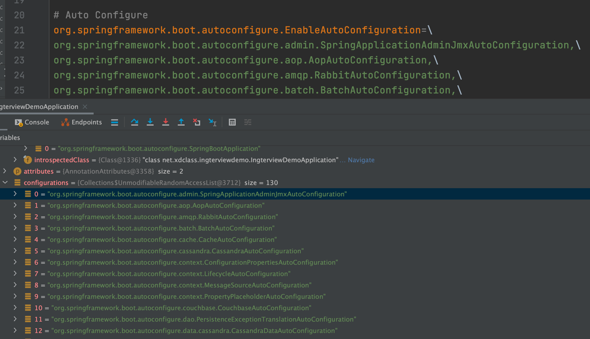

##自己实现IOC容器，这里是最简单的方式  
##*框架的学习方法*

先看做了什么，大致的脉络思路  


原理使用反射
  

map实现Bean的注入

map放东西由Spring帮我们创建  

###IOC容器的管理
IOC容器中的对象都是按照需求创建的  
xml文件和注解等方式，把这些东西（BeanDefinition，源码有BeanDefinitionReader）放到容器中

BeanDefinitionRegistry 注册Bean


事例化好之后

如果要将某一个属性值做修改的话，有100个bean需要设置某个属性（修改bean）

所以DeanDefinition和事例化对象直接还有别的处理  
打开xml？？
不实际太慢


BeanDefinition和BeanFactory之间也有东西
下图是BeanFactoryPostProcessor**这里完成了拓展增强的功能**


  

internalConfigurationProcessor


@SpringBootApplication->@EnableAutoConfiguration

AutoConfigurationImportSelector
```
protected List<String> getCandidateConfigurations(AnnotationMetadata metadata, AnnotationAttributes attributes) {
List<String> configurations = SpringFactoriesLoader.loadFactoryNames(getSpringFactoriesLoaderFactoryClass(),
getBeanClassLoader());
Assert.notEmpty(configurations, "No auto configuration classes found in META-INF/spring.factories. If you "
+ "are using a custom packaging, make sure that file is correct.");
return configurations;
}
```
getSpringFactoriesLoaderFactoryClass方法
```
protected Class<?> getSpringFactoriesLoaderFactoryClass() {
		return EnableAutoConfiguration.class;
	}
```

  
这里面又一个配置



getCandidateConfigurations方法返回的configurations与spring.factories配置的相同


不应该从注解那开始入手分享，网上倒，直到上面有一个spring的refresh方法，
会执行BeanFactoryPostProcessor类，这个类会解析import注解，之后解析


*实例化*：只是调用构造方法，在对堆里面开辟存储空间，其中的属性并没有付值操作  


初始化：