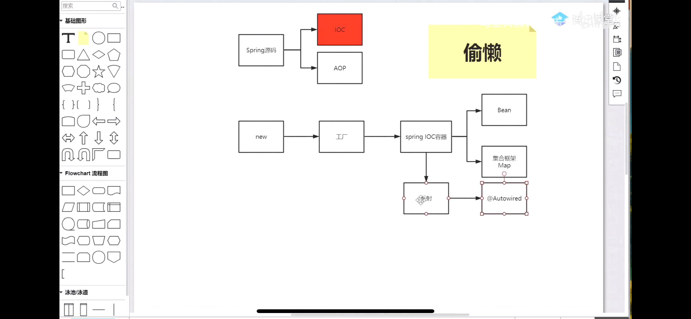

##自己实现IOC容器，这里是最简单的方式  
##*框架的学习方法*

先看做了什么，大致的脉络思路  

原理使用反射
  

map实现Bean的注入

map放东西由Spring帮我们创建  

###IOC容器的管理
IOC容器中的对象都是按照需求创建的  
xml文件和注解等方式，把这些东西（BeanDefinition，源码有BeanDefinitionReader）放到容器中

BeanDefinitionRegistry 注册Bean

事例化好之后

如果要将某一个属性值做修改的话，有100个bean需要设置某个属性（修改bean）

所以DeanDefinition和事例化对象直接还有别的处理  
打开xml？？
不实际太慢

BeanDefinition和BeanFactory之间也有东西
下图是BeanFactoryPostProcessor
