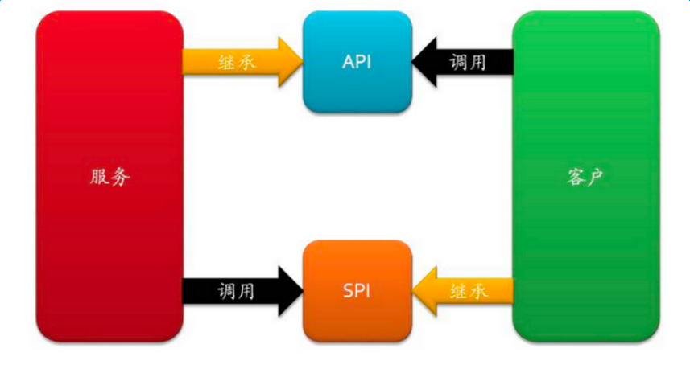
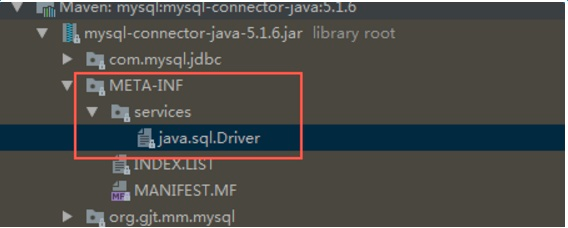
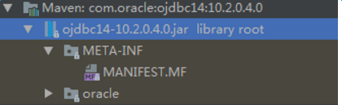
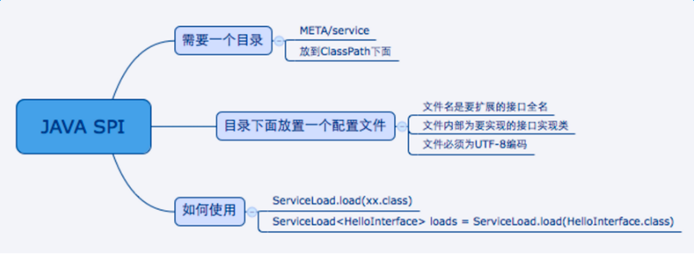

https://zhuanlan.zhihu.com/p/28909673

面向的对象的设计里，我们一般推荐模块之间基于接口编程，模块之间不对实现类进行硬编码。
一旦代码里涉及具体的实现类，就违反了可拔插的原则，如果需要替换一种实现，就需要修改代码。
为了实现在模块装配的时候不用在程序里动态指明，这就需要一种服务发现机制。
java spi就是提供这样的一个机制：为某个接口寻找服务实现的机制。
这有点类似IOC的思想，将装配的控制权移到了程序之外。

调用方--依赖--》interface 《--实现-实现方

首先放个图：
我们在“调用方”和“实现方”之间需要引入“接口”，可以思考一下什么情况应该把接口放入调用方，
什么时候可以把接口归为实现方。

先来看看接口属于实现方的情况，这个很容易理解，实现方提供了接口和实现，我们可以引用接口来达到调用某实现类的功能，这就是我们经常说的api，它具有以下特征：

概念上更接近实现方
组织上位于实现方所在的包中
实现和接口在一个包中
当接口属于调用方时，我们就将其称为spi，全称为：service provider interface，spi的规则如下：

概念上更依赖调用方
组织上位于调用方所在的包中
实现位于独立的包中（也可认为在提供方中）

#开源的案例

接下来从几个案例总结下java spi思想
#Jdk
在jdk6里面引进的一个新的特性ServiceLoader，从官方的文档来说，它主要是用来装载一系列的service provider。而且ServiceLoader可以通过service provider的配置文件来装载指定的service provider。当服务的提供者，提供了服务接口的一种实现之后，我们只需要在jar包的META-INF/services/目录里同时创建一个以服务接口命名的文件。该文件里就是实现该服务接口的具体实现类。而当外部程序装配这个模块的时候，就能通过该jar包META-INF/services/里的配置文件找到具体的实现类名，并装载实例化，完成模块的注入。
可能上面讲的有些抽象，下面就结合一个示例来具体讲讲。

这就是因为ServiceLoader.load(Search.class)在加载某接口时，会去META-INF/services下找接口的全限定名文件，再根据里面的内容加载相应的实现类。

这就是spi的思想，接口的实现由provider实现，provider只用在提交的jar包里的META-INF/services下根据平台定义的接口新建文件，并添加进相应的实现类内容就好。

那为什么配置文件为什么要放在META-INF/services下面？
可以打开ServiceLoader的代码，里面定义了文件的PREFIX如下：
##
private static final String PREFIX = "META-INF/services/"
以上是我们自己的实现，接下来可以看下jdk中DriverManager的spi设计思路

#DriverManager spi案例

DriverManager是jdbc里管理和注册不同数据库driver的工具类。从它设计的初衷来看，和我们前面讨论的场景有相似之处。针对一个数据库，可能会存在着不同的数据库驱动实现。我们在使用特定的驱动实现时，不希望修改现有的代码，而希望通过一个简单的配置就可以达到效果。

我们在使用mysql驱动的时候，会有一个疑问，DriverManager是怎么获得某确定驱动类的？

我们在运用Class.forName("com.mysql.jdbc.Driver")加载mysql驱动后，就会执行其中的静态代码把driver注册到DriverManager中，以便后续的使用。
代码如下：

package com.mysql.jdbc;

public class Driver extends NonRegisteringDriver implements java.sql.Driver {
public Driver() throws SQLException {
}

    static {
        try {
            DriverManager.registerDriver(new Driver());
        } catch (SQLException var1) {
            throw new RuntimeException("Can't register driver!");
        }
    }
}

这里可以看到，不同的驱动实现了相同的接口java.sql.Driver，然后通过registerDriver把当前driver加载到DriverManager中
这就体现了使用方提供规则，提供方根据规则把自己加载到使用方中的spi思想

这里有一个有趣的地方，查看DriverManager的源码，可以看到其内部的静态代码块中有一个loadInitialDrivers方法，在注释中我们看到用到了上文提到的spi工具类ServiceLoader

/**
* Load the initial JDBC drivers by checking the System property
* jdbc.properties and then use the {@code ServiceLoader} mechanism
  */
  static {
  loadInitialDrivers();
  println("JDBC DriverManager initialized");
  }

ServiceLoader<Driver> loadedDrivers = ServiceLoader.load(Driver.class);
Iterator<Driver> drivers = loadedDrivers.iterator();
println("DriverManager.initialize: jdbc.drivers = " + loadedDrivers);

可见，DriverManager初始化时也运用了spi的思想，使用ServiceLoader把写到配置文件里的Driver都加载了进来。

我们打开mysql-connector-java的jar包，果然在META-INF/services下发现了上文中提到的接口路径，打开里面的内容，可以看到是com.mysql.jdbc.Driver

其实对符合DriverManager设定规则的驱动，我们并不用去调用class.forname，直接连接就好.因为DriverManager在初始化的时候已经把所有符合的驱动都加载进去了，避免了在程序中频繁加载。

但对于没有符合配置文件规则的驱动，如oracle，它还是需要去显示调用classforname，再执行静态代码块把驱动加载到manager里，因为它不符合配置文件规则:

最后总结一下jdk spi需要遵循的规范

