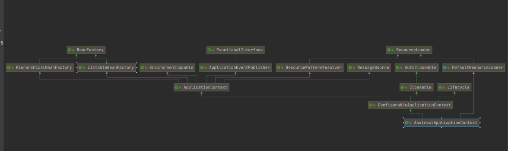
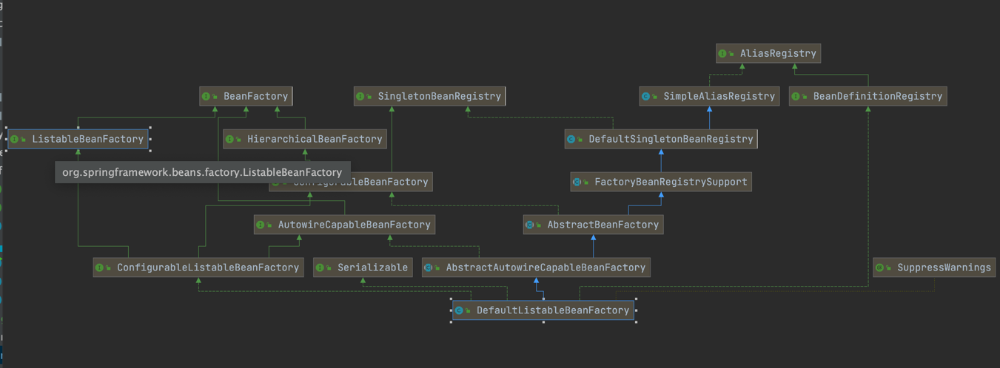

###看源码的方法
1、不要忽略源码的注解  
2、不要开始的时候就深入细节，死扣某一个  
3、大胆猜测、大胆验证 8分靠猜  
4、见名知意  
5、坚持、坚持、坚持  

###1、BeanDefinitionBeanFactory和Bean的关系

BeanDefinition（原材料）--->BeanFactory（工厂）--->Bean（产品）
###2、BeanFactory的核心实现子接口

###3、Bean的生命周期
（1）BeanDefinition Bean定义--  
（2）构造方法推断，选出构造方法   
（3）实例化 构造方法反射得到对象  
（4）属性填充  
（5）初始化  
（6）初始化后AOP、生成代理对象  

###4、

###5、
###6、
###7、
###8、
###9、
###10
###11
###12
###13
###14
###15
###16
###17
###18
###19
###20 集合
#####hashMap

###21
###22
###23
###24
###25
###26
###27
###28
###29
