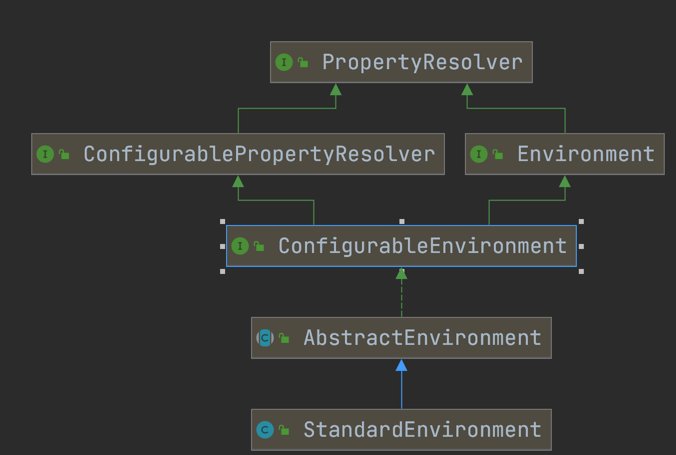

###看源码的方法
1、不要忽略源码的注解  
2、不要开始的时候就深入细节，死扣某一个  
3、大胆猜测、大胆验证 8分靠猜  
4、见名知意  
5、坚持、坚持、坚持

###1、BeanDefinitionBeanFactory和Bean的关系

BeanDefinition（原材料）--->BeanFactory（工厂）--->Bean（产品）
###2、BeanFactory的核心实现子接口

###3、Bean的生命周期
（1）BeanDefinition Bean定义--  
（2）构造方法推断，选出构造方法   
（3）实例化 构造方法反射得到对象  
（4）属性填充  
（5）初始化  
（6）初始化后AOP、生成代理对象

###4、

###spring中的一些继承和实现关系

standardEnvironment 是prepareRefresh()方法创建的环境，如果private ConfigurableEnvironment environment;
environment为空则创建一个标准的环境  
**PropertySource：属性源。**    key-value属性对抽象   

**PropertyResolver：属性解析器。** 用于解析相应key的value

DefaultListableBeanFactory  
BeanFactory只是一个接口，我们最终需要一个该接口的实现来进行实际的Bean的管理，DefaultListableBeanFactory就是这么一个比较通用的BeanFactory实现类。
DefaultListableBeanFactory除了间接地实现了BeanFactory接口，还实现了BeanDefinitionRegistry接口，该接口才
是在BeanFactory的实现中担当Bean注册管理的角色。基本上，BeanFactory接口只定义如何访问容
器内管理的Bean的方法，各个BeanFactory的具体实现类负责具体Bean的注册以及管理工作。
BeanDefinitionRegistry接口定义抽象了Bean的注册逻辑。通常情况下，具体的BeanFactory实现
// Tell the subclass to refresh the internal bean factory.
ConfigurableListableBeanFactory beanFactory = obtainFreshBeanFactory();
创建的默认工厂
AbstractRefreshableApplicationContext创建  

###BeanDefinition

###BeanDefinitionRegistry
Interface for registries that hold bean definitions, for example RootBeanDefinition and ChildBeanDefinition instances. Typically implemented by BeanFactories that internally work with the AbstractBeanDefinition hierarchy.
This is the only interface in Spring's bean factory packages that encapsulates （封装）registration of bean definitions. The standard BeanFactory interfaces only cover access to a fully configured factory instance.
Spring's bean definition readers expect to work on an implementation of this interface. Known implementors within the Spring core are DefaultListableBeanFactory and GenericApplicationContext
BeanDefinitionRegistry就像图书馆的书架，所有的书是放在书架上的。   
虽然你
还书或者借书都是跟图书馆（也就是BeanFactory，或许BookFactory可能更好些）打交道，但书架才
是图书馆存放各类图书的地方。所以，书架相对于图书馆来说，就是它的“BookDefinitionRegistry”。
###PlaceholderConfigurerSupport
占位符配置支持，把配置文件中的资源属性读取解析如properties和xml配置文件  

Abstract base class for property resource configurers that resolve placeholders in bean definition property values. Implementations pull values from a properties file or other property source into bean definitions.
The default placeholder syntax follows the Ant / Log4J / JSP EL style:
${...}
Example XML bean definition:
<bean id="dataSource" class="org.springframework.jdbc.datasource.DriverManagerDataSource"/>
<property name="driverClassName" value="${driver}"/>
<property name="url" value="jdbc:${dbname}"/>
</bean>

Example properties file:
driver=com.mysql.jdbc.Driver
dbname=mysql:mydb

###ConfigurationClassPostProcessor

BeanFactoryPostProcessor used for bootstrapping processing of @Configuration classes.  
Registered by default when using <context:annotation-config/> or <context:component-scan/>.   
Otherwise, may be declared manually as with any other BeanFactoryPostProcessor.
This post processor is priority-ordered as it is important that any Bean methods declared in @Configuration classes have their corresponding bean definitions registered before any other BeanFactoryPostProcessor executes.

###ConfigurationClassParser
Parses a Configuration class definition, populating a collection of ConfigurationClass objects (parsing a single Configuration class may result in any number of ConfigurationClass objects because one Configuration class may import another using the Import annotation).  
This class helps separate the concern of parsing the structure of a Configuration class from the concern of registering BeanDefinition objects based on the content of that model (with the exception of @ComponentScan annotations which need to be registered immediately).  
This ASM-based implementation avoids reflection and eager class loading in order to interoperate effectively with lazy class loading in a Spring ApplicationContext.
###