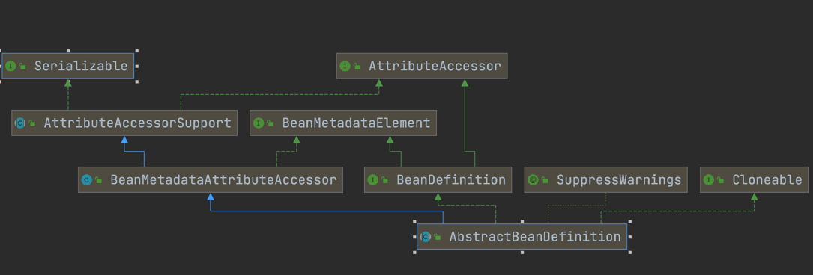

###1、看源码的方法
1、不要忽略源码的注解  
2、不要开始的时候就深入细节，死扣某一个  
3、大胆猜测、大胆验证 8分靠猜  
4、见名知意  
5、坚持、坚持、坚持


###1、BeanDefinition、BeanFactory和Bean的关系


BeanDefinition（原材料）--->BeanFactory（工厂）--->Bean（产品）
###2、BeanFactory的核心实现子接口


###3、Bean的生命周期
（1）BeanDefinition Bean定义--  
（2）构造方法推断，选出构造方法   
（3）实例化 构造方法反射得到对象  
（4）属性填充  
（5）初始化  
（6）初始化后AOP、生成代理对象

###4、AbstractBeanDefinition

###5、StandardEnvironment

standardEnvironment 是prepareRefresh()方法创建的环境，如果private ConfigurableEnvironment environment;
environment为空则创建一个标准的环境  
**PropertySource：属性源。**    key-value属性对抽象   


**PropertyResolver：属性解析器。** 用于解析相应key的value

###6、BeanDefinitionBeanFactory和Bean的关系


BeanDefinition（原材料）--->BeanFactory（工厂）--->Bean（产品）


DefaultListableBeanFactory  
BeanFactory只是一个接口，我们最终需要一个该接口的实现来进行实际的Bean的管理，DefaultListableBeanFactory就是这么一个比较通用的BeanFactory实现类。
DefaultListableBeanFactory除了间接地实现了BeanFactory接口，还实现了BeanDefinitionRegistry接口，该接口才
是在BeanFactory的实现中担当Bean注册管理的角色。基本上，BeanFactory接口只定义如何访问容
器内管理的Bean的方法，各个BeanFactory的具体实现类负责具体Bean的注册以及管理工作。
BeanDefinitionRegistry接口定义抽象了Bean的注册逻辑。通常情况下，具体的BeanFactory实现
// Tell the subclass to refresh the internal bean factory.
ConfigurableListableBeanFactory beanFactory = obtainFreshBeanFactory();
创建的默认工厂
AbstractRefreshableApplicationContext创建  

###7、常见的类


####7.1BeanDefinition


####7.2BeanDefinitionRegistry
Interface for registries that hold bean definitions, for example RootBeanDefinition and ChildBeanDefinition instances. Typically implemented by BeanFactories that internally work with the AbstractBeanDefinition hierarchy.
This is the only interface in Spring's bean factory packages that encapsulates （封装）registration of bean definitions. The standard BeanFactory interfaces only cover access to a fully configured factory instance.
Spring's bean definition readers expect to work on an implementation of this interface. Known implementors within the Spring core are DefaultListableBeanFactory and GenericApplicationContext
BeanDefinitionRegistry就像图书馆的书架，所有的书是放在书架上的。   
虽然你
还书或者借书都是跟图书馆（也就是BeanFactory，或许BookFactory可能更好些）打交道，但书架才
是图书馆存放各类图书的地方。所以，书架相对于图书馆来说，就是它的“BookDefinitionRegistry”。
####7.3PlaceholderConfigurerSupport
占位符配置支持，把配置文件中的资源属性读取解析如properties和xml配置文件  

Abstract base class for property resource configurers that resolve placeholders in bean definition property values. Implementations pull values from a properties file or other property source into bean definitions.
The default placeholder syntax follows the Ant / Log4J / JSP EL style:
${...}
Example XML bean definition:
<bean id="dataSource" class="org.springframework.jdbc.datasource.DriverManagerDataSource"/>
<property name="driverClassName" value="${driver}"/>
<property name="url" value="jdbc:${dbname}"/>
</bean>

Example properties file:
driver=com.mysql.jdbc.Driver
dbname=mysql:mydb

###ConfigurationClassPostProcessor

BeanFactoryPostProcessor used for bootstrapping processing of @Configuration classes.  
Registered by default when using <context:annotation-config/> or <context:component-scan/>.   
Otherwise, may be declared manually as with any other BeanFactoryPostProcessor.
This post processor is priority-ordered as it is important that any Bean methods declared in @Configuration classes have their corresponding bean definitions registered before any other BeanFactoryPostProcessor executes.

###ConfigurationClassParser
Parses a Configuration class definition, populating a collection of ConfigurationClass objects (parsing a single Configuration class may result in any number of ConfigurationClass objects because one Configuration class may import another using the Import annotation).  
This class helps separate the concern of parsing the structure of a Configuration class from the concern of registering BeanDefinition objects based on the content of that model (with the exception of @ComponentScan annotations which need to be registered immediately).  
This ASM-based implementation avoids reflection and eager class loading in order to interoperate effectively with lazy class loading in a Spring ApplicationContext.


###ClassPathXmlApplicationContext
Create a new ClassPathXmlApplicationContext with the given parent, loading the definitions from the given XML files.  

Params:  
configLocations – array of resource locations  
refresh – whether to automatically refresh the context, loading all bean definitions and creating all singletons.   
Alternatively, call refresh manually after further configuring the context.  
parent – the parent context
作用创建一个新的上下文环境，加载xml配置的BeanDefinition
spring启动之后会调用这个构造方法，方法中的参数为配置资源文件的数组  
refresh 规定了是否可以自动的更新上下文，加载并创建所以的单例Bean
或者，在进一步配置上下文后手动调用refresh。
parent – 父上下文
```
public ClassPathXmlApplicationContext(
			String[] configLocations, boolean refresh, @Nullable ApplicationContext parent)
			throws BeansException {

		super(parent);
		setConfigLocations(configLocations);
		if (refresh) {
			refresh();
		}
	}
```
###ClassPathXmlApplicationContext类的refresh方法是继承ConfigurableApplicationContext.java方法的

###spring中refresh方法里的的重要方法

// Initialize any placeholder property sources in the context environment.
####1.7.7  initPropertySources();
该方法供我们自己实现，可以增强在上下文的环境中初始化配置符的属性资源

实现方法


因为ClassPathXmlApplicationContext继承了AbstractApplicationContext
所以只要重写initPropertySources方法即可。
```
public class MyClassPathXmlApplicationContext extends ClassPathXmlApplicationContext {

    //这里需要注意，要调用父类的方法，否则无法实现调用
    public MyClassPathXmlApplicationContext(String... configLocations){
        super(configLocations);
    }

    @Override
    protected void initPropertySources() {
        System.out.println("扩展initPropertySource");
        //这里添加了一个name属性到Environment里面，以方便我们在后面用到
        getEnvironment().getSystemProperties().put("name","xx");
        //这里要求Environment中必须包含username属性，如果不包含，则抛出异常
        getEnvironment().setRequiredProperties("username");
    }
}
public class Test {

    public static void main(String[] args) {
        MyClassPathXmlApplicationContext ac = new MyClassPathXmlApplicationContext("applicationContext.xml");

//        ClassPathXmlApplicationContext context = new ClassPathXmlApplicationContext("spring-${username}.xml");
    }
}


```
这里做了两个扩展  
1、向Environment中添加了一个name属性值。  
2、我们设置了一个必要的系统属性username，当Environment中不包含username属性时系统会抛出异常。

调用完这个方法之后，会进行校验如果没有这个参数会报错    
```
// Validate that all properties marked as required are resolvable:
// see ConfigurablePropertyResolver#setRequiredProperties
getEnvironment().validateRequiredProperties();
```
####1.7.8 refreshBeanFactory()
refresh方法中obtainFreshBeanFactory获取新鲜的bean工厂方法  

// Tell the subclass to refresh the internal bean factory.
ConfigurableListableBeanFactory beanFactory = obtainFreshBeanFactory();

在使用spring的时候，我门会做很多配置，
做了那么多多配置，到底是什么时候把这些配置加载进来呢？？
通过debug阅读源码发现在AbstractRefreshableApplicationContext接口的refreshBeanFactory()方法能够实现配置文件的加载。
该方法中有一个loadBeanDefinitions(beanFactory);加载bean的定义的方法。入参是beanFactory这里是DefaultListableBeanFactory
```
	protected void loadBeanDefinitions(DefaultListableBeanFactory beanFactory) throws BeansException, IOException {
		// Create a new XmlBeanDefinitionReader for the given BeanFactory.
		XmlBeanDefinitionReader beanDefinitionReader = new XmlBeanDefinitionReader(beanFactory);

		// Configure the bean definition reader with this context's
		// resource loading environment.
		beanDefinitionReader.setEnvironment(this.getEnvironment());
		beanDefinitionReader.setResourceLoader(this);
		beanDefinitionReader.setEntityResolver(new ResourceEntityResolver(this));

		// Allow a subclass to provide custom initialization of the reader,
		// then proceed with actually loading the bean definitions.
		initBeanDefinitionReader(beanDefinitionReader);
		loadBeanDefinitions(beanDefinitionReader);
	}

```
这是一个私有的方法，参数是一个BeanFactory

1、内部主要创建了一个XmlBeanDefinitionReader用来读解析xml的配置文件。  
2、之后设置一些属性  
3、把刚才设置的bean初始化的读取器进行初始化操作  
4、通过bean的读取器加载配置  
这里主要说一下loadBeanDefinition方法
```
	protected void loadBeanDefinitions(XmlBeanDefinitionReader reader) throws BeansException, IOException {
		Resource[] configResources = getConfigResources();
		if (configResources != null) {
			reader.loadBeanDefinitions(configResources);
		}
		//这里把全部xml配置加载出来  xxx.xml applicationContext.xml

		String[] configLocations = getConfigLocations();
		if (configLocations != null) {
			reader.loadBeanDefinitions(configLocations);
		}
	}
```
接下来看一下这个加载Bean定义的实现细节
```
 * Load bean definitions from the specified resource location.
	 * <p>The location can also be a location pattern, provided that the
	 * ResourceLoader of this bean definition reader is a ResourcePatternResolver.
	 * @param location the resource location, to be loaded with the ResourceLoader
	 * (or ResourcePatternResolver) of this bean definition reader
	 * @param actualResources a Set to be filled with the actual Resource objects
	 * that have been resolved during the loading process. May be {@code null}
	 * to indicate that the caller is not interested in those Resource objects.
	 * @return the number of bean definitions found
```


### 1.7.9initServletPropertySource
WebApplicationContextUtils类的方法
```
public static void initServletPropertySources(MutablePropertySources sources, @Nullable ServletContext servletContext, @Nullable ServletConfig servletConfig) {
        Assert.notNull(sources, "'propertySources' must not be null");
        String name = "servletContextInitParams";
        if (servletContext != null && sources.get(name) instanceof StubPropertySource) {
            sources.replace(name, new ServletContextPropertySource(name, servletContext));
        }

        name = "servletConfigInitParams";
        if (servletConfig != null && sources.get(name) instanceof StubPropertySource) {
            sources.replace(name, new ServletConfigPropertySource(name, servletConfig));
        }

    }
```


###能够进行扩展的地方


####initPropertySources();MyClassPathXmlApplicationContext.java 配置校验一些属性值  
```// Store pre-refresh ApplicationListeners...
		if (this.earlyApplicationListeners == null) {
			this.earlyApplicationListeners = new LinkedHashSet<>(this.applicationListeners);
		}
		else {
			// Reset local application listeners to pre-refresh state.
			this.applicationListeners.clear();
			this.applicationListeners.addAll(this.earlyApplicationListeners);
		}

		// Allow for the collection of early ApplicationEvents,
		// to be published once the multicaster is available...
		this.earlyApplicationEvents = new LinkedHashSet<>();
```
this.earlyApplicationListeners == null这里为啥要进行==null的判断？  
初始化  某些时候这里不为nullspringboot中有很多ApplicationListener  
这些listener也可以实现扩展。  
 ####是否能够覆盖Bean的定义和允许解决循环依赖问题
allowBeanDefinitionOverride 属性
allowCircularReference

这两个属性能够进行拓展  
customizeBeanFactory方法进行属性的设置
```
protected void customizeBeanFactory(DefaultListableBeanFactory beanFactory) {
		if (this.allowBeanDefinitionOverriding != null) {
			beanFactory.setAllowBeanDefinitionOverriding(this.allowBeanDefinitionOverriding);
		}
		if (this.allowCircularReferences != null) {
			beanFactory.setAllowCircularReferences(this.allowCircularReferences);
		}
	}
```
