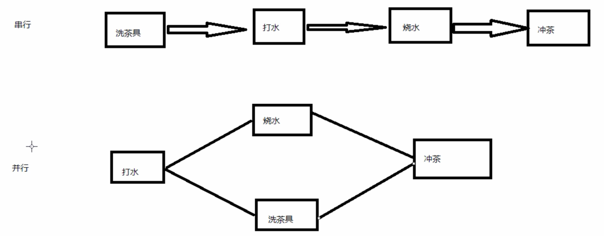

#multiThread
## 第二章 
### 2.1

简介：介绍什么事并发编程、并发历史、串行跟并行的区别、并发编程的目的以及什么时候适合用并发编程

* 1.什么是并发编程

* 2.并发历史: 早期计算机--从头到尾执行一个程序，资源浪费​ 操作系统出现--计算机能运行多个程序，不同的程序在不同的单独的进程中运行

一个进程，有多个线程​ 提高资源的利用率，公平

* 3.串行与并行的区别
  
串行：洗茶具、打水、烧水、等水开、冲茶​ 并行：打水、烧水同时洗茶具、水开、冲茶

好处：可以缩短整个流程的时间

* 4.并发编程目的

摩尔定律：当价格不变时，集成电路上可容纳的元器件的数目，约每隔18-24个月便会增加一倍，性能也将提升一倍。这一定律揭示了信息技术进步的速度。​ 让程序充分利用计算机资源​ 加快程序响应速度（耗时任务、web服务器）​ 简化异步事件的处理

* 5.什么时候适合使用并发编程

任务会阻塞线程，导致之后的代码不能执行：比如一边从文件中读取，一边进行大量计算的情况 任务执行时间过长，可以划分为分工明确的子任务：比如分段下载 任务间断性执行：日志打印 任务本身需要协作执行：比如生产者消费者问题

