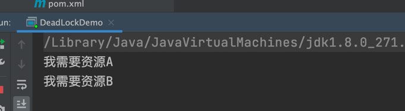
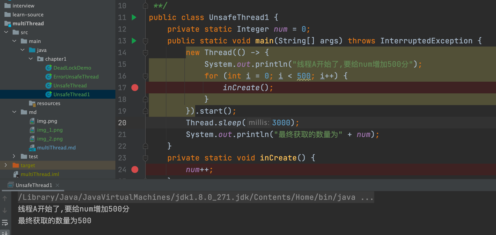
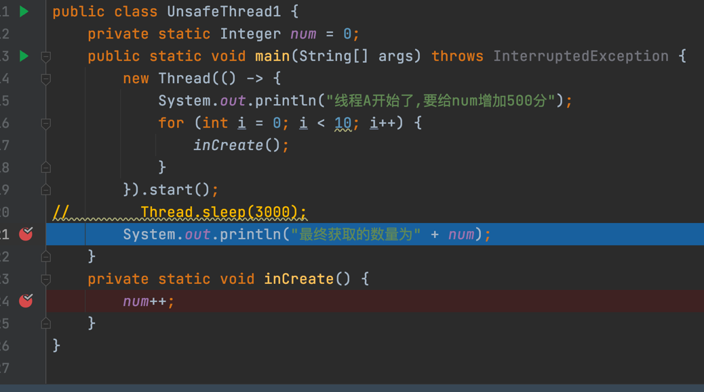

#multiThread
## 第二章 
### 2.1

简介：介绍什么事并发编程、并发历史、串行跟并行的区别、并发编程的目的以及什么时候适合用并发编程

* 1.什么是并发编程

* 2.并发历史: 早期计算机--从头到尾执行一个程序，资源浪费​ 操作系统出现--计算机能运行多个程序，不同的程序在不同的单独的进程中运行

一个进程，有多个线程​ 提高资源的利用率，公平

* 3.串行与并行的区别
  
串行：洗茶具、打水、烧水、等水开、冲茶​ 并行：打水、烧水同时洗茶具、水开、冲茶

好处：可以缩短整个流程的时间


* 4.并发编程目的

摩尔定律：当价格不变时，集成电路上可容纳的元器件的数目，约每隔18-24个月便会增加一倍，性能也将提升一倍。这一定律揭示了信息技术进步的速度。​ 让程序充分利用计算机资源​ 加快程序响应速度（耗时任务、web服务器）​ 简化异步事件的处理

* 5.什么时候适合使用并发编程

任务会阻塞线程，导致之后的代码不能执行：比如一边从文件中读取，一边进行大量计算的情况 任务执行时间过长，可以划分为分工明确的子任务：比如分段下载 任务间断性执行：日志打印 任务本身需要协作执行：比如生产者消费者问题

###2.2并非挑战---上下文的频繁切换
cpu为线程分配时间片，时间片非常短（毫秒级别），cpu不停的切换线程执行，在切换前会保存上一个任务的状态，以便下次切换回这个任务时，可以再加载这个任务的状态，让我们感觉是多个程序同时运行的。

上下文的频繁切换，会带来一定的性能开销

* 如何减少上下文切换的开销？

* 无锁并发编程

  无锁并发编程。多线程竞争锁时，会引起上下文切换，所以多线程处理数据时，可以用一些办法来避免使用锁，如将数据的ID按照Hash算法取模分段，不同的线程处理不同段的数据

* CAS

  Java的Atomic包使用CAS算法来更新数据，而不需要加锁。

* 使用最少线程。

  避免创建不需要的线程，比如任务很少，但是创建了很多线程来处理，这样会造成大量线程都处于等待状态

* 协程

  在单线程里实现多任务的调度，并在单线程里维持多个任务间的切换。--GO

###2.3死锁问题
见类DeadLockDemo类

运行main方法之后，程序会一直停在这里  
###2.4并发编程的挑战之线程安全
```
    private static Integer num = 0;
    public static void main(String[] args) throws InterruptedException {
        new Thread(() -> {
            System.out.println("线程A开始了,要给num增加500分");
            for (int i = 0; i < 500; i++) {
                inCreate(num);
            }
        }).start();
        System.out.println("最终获取的数量为" + num);
    }
    private static void inCreate(Integer num) {
        num++;
    }
这里方法不能传参数

```
这里一直是0，因为还没调用inCreate方法，就执行打印了




断点调试的时候，这里直接进入到Thread.sleep方法没有执行inCreate方法

###
###
###
##
##
##

