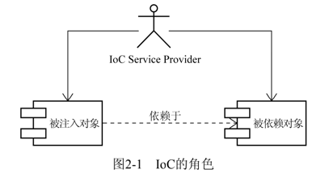

# Getting Started

### Reference Documentation

For further reference, please consider the following sections:

* [Official Apache Maven documentation](https://maven.apache.org/guides/index.html)
* [Spring Boot Maven Plugin Reference Guide](https://docs.spring.io/spring-boot/docs/2.5.0/maven-plugin/reference/html/)
* [Create an OCI image](https://docs.spring.io/spring-boot/docs/2.5.0/maven-plugin/reference/html/#build-image)
* [Spring Web](https://docs.spring.io/spring-boot/docs/2.5.0/reference/htmlsingle/#boot-features-developing-web-applications)

### Guides

The following guides illustrate how to use some features concretely:

* [Building a RESTful Web Service](https://spring.io/guides/gs/rest-service/)
* [Serving Web Content with Spring MVC](https://spring.io/guides/gs/serving-web-content/)
* [Building REST services with Spring](https://spring.io/guides/tutorials/bookmarks/)

#spring 揭秘笔记


###chapter2
就反转在让你从原来的事必躬亲，转变为现在的享受服务,所以，简单点儿说，IoC的理念就是，
让别人为你服务！在图2-1中，也就是让IoC Service Provider来为你服务！  


通常情况下，被注入对象会直接依赖于被依赖对象。但是，在IoC的场景中，二者之间通过IoC Service
Provider来打交道，所有的被注入对象和依赖对象现在由IoC Service Provider统一管理。被注入对象需要
什么，直接跟IoC Service Provider招呼一声，后者就会把相应的被依赖对象注入到被注入对象中，从而
达到IoC Service Provider为被注入对象服务的目的。IoC Service Provider在这里就是通常的IoC容器所充
当的角色。从被注入对象的角度看，与之前直接寻求依赖对象相比，依赖对象的取得方式发生了反转，
控制也从被注入对象转到了IoC Service Provider那里

###查询方式
不管怎样，你终究会找到一种方式来向服务生表达你的需求，以便他为你提供适当的服务。那么，
在IoC模式中，被注入对象又是通过哪些方式来通知IoC Service Provider为其提供适当服务的呢？ 
IoC模式最权威的总结和解释，应该是Martin Fowler的那篇文章“Inversion of Control Containers and
the Dependency Injection pattern”，    
其中提到了三种依赖注入的方式，即构造方法注入（constructor
injection）、setter方法注入（setter injection）以及接口注入（interface injection）。下面让我们详细看
一下这三种方式的特点及其相互之间的差别。  
####1、构造方法注入
是被注入对象可以通过在其构造方法中声明依赖对象的参数列表，
让外部（通常是IoC容器）知道它需要哪些依赖对象。chaper2-1 FXNewsProvider
```
public FXNewsProvider(IFXNewsListener newsListner,IFXNewsPersister newsPersister) 
{ 
 this.newsListener = newsListner; 
this.newPersistener = newsPersister; 
}
```
IoC Service Provider会检查被注入对象的构造方法，取得它所需要的依赖对象列表，进而为其注
入相应的对象。同一个对象是**不可能被构造两次**的，因此，被注入对象的构造乃至其整个生命周期，
应该是由IoC Service Provider来管理的。
构造方法注入方式比较直观，对象被构造完成后，即进入就绪状态，可以马上使用。这就好比你
刚进酒吧的门，服务生已经将你喜欢的啤酒摆上了桌面一样。坐下就可马上享受一份清凉与惬意。
####2、setter方法注入  


####3、接口注入
