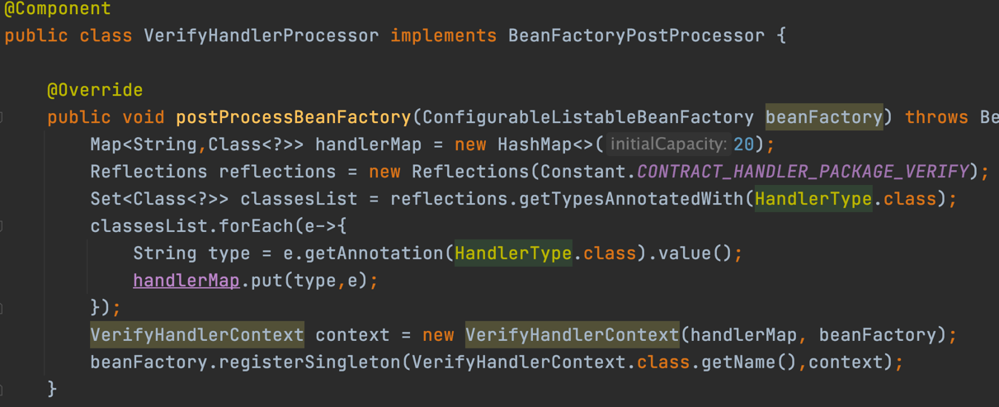
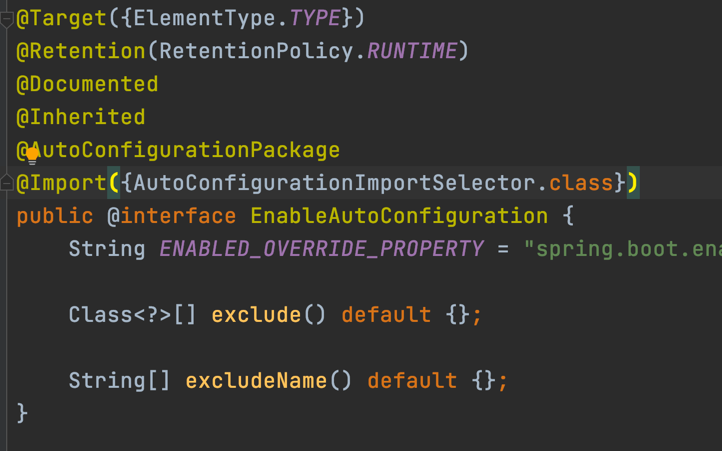
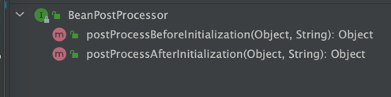
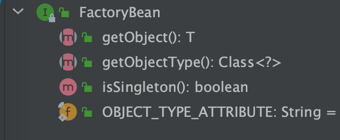
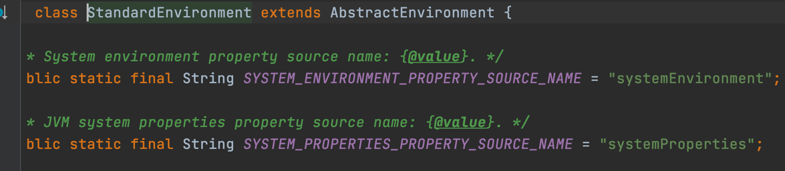
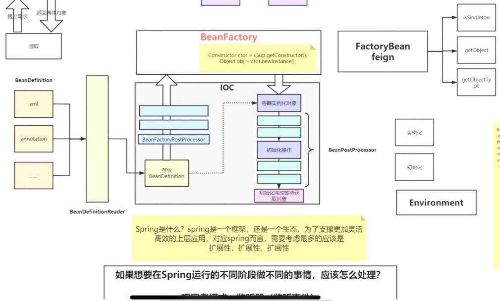

##自己实现IOC容器，这里是最简单的方式  
##*框架的学习方法*
b站视频  
先看做了什么，大致的脉络思路  


原理使用反射
  

map实现Bean的注入

map放东西由Spring帮我们创建  

###IOC容器的管理
IOC容器中的对象都是按照需求创建的  
xml文件和注解等方式，把这些东西（BeanDefinition，源码有BeanDefinitionReader）放到容器中

BeanDefinitionRegistry 注册Bean


事例化好之后

如果要将某一个属性值做修改的话，有100个bean需要设置某个属性（修改bean）

所以DeanDefinition和事例化对象直接还有别的处理  
打开xml？？
不实际太慢


BeanDefinition和BeanFactory之间也有东西
下图是BeanFactoryPostProcessor**这里完成了拓展增强的功能**


  

internalConfigurationProcessor


@SpringBootApplication->@EnableAutoConfiguration

AutoConfigurationImportSelector
```
protected List<String> getCandidateConfigurations(AnnotationMetadata metadata, AnnotationAttributes attributes) {
List<String> configurations = SpringFactoriesLoader.loadFactoryNames(getSpringFactoriesLoaderFactoryClass(),
getBeanClassLoader());
Assert.notEmpty(configurations, "No auto configuration classes found in META-INF/spring.factories. If you "
+ "are using a custom packaging, make sure that file is correct.");
return configurations;
}
```
getSpringFactoriesLoaderFactoryClass方法
```
protected Class<?> getSpringFactoriesLoaderFactoryClass() {
		return EnableAutoConfiguration.class;
	}
```

  
这里面又一个配置


getCandidateConfigurations方法返回的configurations与spring.factories配置的相同


不应该从注解那开始入手分享，网上倒，直到上面有一个spring的refresh方法，
会执行BeanFactoryPostProcessor类，这个类会解析import注解，之后解析


*实例化*：只是调用构造方法，在对堆里面开辟存储空间，其中的属性并没有付值操作  


初始化：
  
这里就是Bean的生命周期的管理
###1、先进行 实例化
BeanFactory接口做了什么事情？？  
***bean的生命周期***


注意**BeanPostProcessor**的类型
  

BeanPostProcessor这个接口也是提供拓展使用的  

 
**AOP是在初始化操作之前实现的**
###FactoryBean feign
feign源码  FeignClientFactoryBean impl FactoryBean  

定制的特殊的对象  

**一般情况下用BeanFactory创建，特殊情况用FactoryBean创建对象**




重要的对象  
Environment
有一个standardEnvironment
这里有一个

System.getenv();
System.getProperties()  
###?如果想在spring运行的不同阶段做不同的事情，应该怎么处理？？？
观察者模式。监听器（监听事件）每次完成什么事情之后，再去做什么  
观察者模式伴随着整个IOC容器



###refresh方法必看
abstractApplicationContext 13个方法
1、先创建出IOC容器，用来加载读取的配置文件
2、

```
@Override
	public void refresh() throws BeansException, IllegalStateException {
		synchronized (this.startupShutdownMonitor) {
			StartupStep contextRefresh = this.applicationStartup.start("spring.context.refresh");

			// Prepare this context for refreshing.
			prepareRefresh();

			// Tell the subclass to refresh the internal bean factory.
			ConfigurableListableBeanFactory beanFactory = obtainFreshBeanFactory();

			// Prepare the bean factory for use in this context.
			prepareBeanFactory(beanFactory);

			try {
				// Allows post-processing of the bean factory in context subclasses.
				postProcessBeanFactory(beanFactory);

				StartupStep beanPostProcess = this.applicationStartup.start("spring.context.beans.post-process");
				// Invoke factory processors registered as beans in the context.
				invokeBeanFactoryPostProcessors(beanFactory);

				// Register bean processors that intercept bean creation.
				registerBeanPostProcessors(beanFactory);
				beanPostProcess.end();

				// Initialize message source for this context.
				initMessageSource();

				// Initialize event multicaster for this context.
				initApplicationEventMulticaster();

				// Initialize other special beans in specific context subclasses.
				onRefresh();

				// Check for listener beans and register them.
				registerListeners();

				// Instantiate all remaining (non-lazy-init) singletons.
				finishBeanFactoryInitialization(beanFactory);

				// Last step: publish corresponding event.
				finishRefresh();
			}

			catch (BeansException ex) {
				if (logger.isWarnEnabled()) {
					logger.warn("Exception encountered during context initialization - " +
							"cancelling refresh attempt: " + ex);
				}

				// Destroy already created singletons to avoid dangling resources.
				destroyBeans();

				// Reset 'active' flag.
				cancelRefresh(ex);

				// Propagate exception to caller.
				throw ex;
			}

			finally {
				// Reset common introspection caches in Spring's core, since we
				// might not ever need metadata for singleton beans anymore...
				resetCommonCaches();
				contextRefresh.end();
			}
		}
	}
```