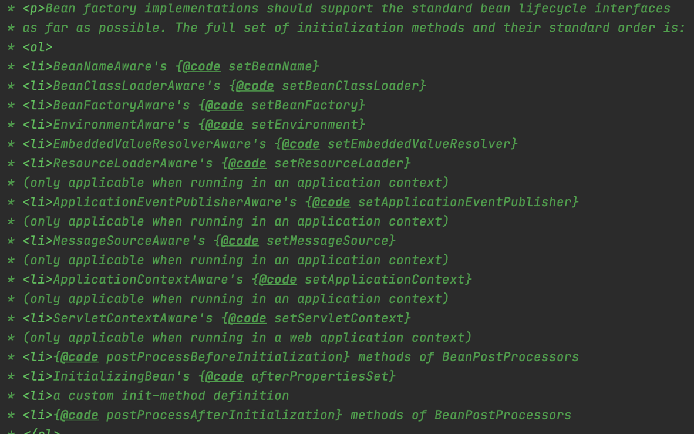

##自己实现IOC容器，这里是最简单的方式  
##*框架的学习方法*
b站视频  
先看做了什么，大致的脉络思路  


原理使用反射
  

map实现Bean的注入

map放东西由Spring帮我们创建  

###IOC容器的管理
IOC容器中的对象都是按照需求创建的  
xml文件和注解等方式，把这些配置文件通过BeanDefinitionReader读到DeanDefinition中，（放到BeanDefinitionRegister上架子）（BeanDefinition，源码有BeanDefinitionReader）放到容器中

BeanDefinitionRegistry 注册Bean（类似一个架子）


事例化好之后

如果要将某一个属性值做修改的话，有100个bean需要设置某个属性（修改bean）

所以DeanDefinition和事例化对象直接还有别的处理  
打开xml？？不实际太慢   
猜想肯定会有相关的reader进行属性的读取操作，不同类型的配置文件有不同的读取器。


BeanDefinition和BeanFactory之间也有东西
下图是BeanFactoryPostProcessor**这里完成了拓展增强的功能**


  

internalConfigurationProcessor


@SpringBootApplication->@EnableAutoConfiguration

AutoConfigurationImportSelector
```
protected List<String> getCandidateConfigurations(AnnotationMetadata metadata, AnnotationAttributes attributes) {
List<String> configurations = SpringFactoriesLoader.loadFactoryNames(getSpringFactoriesLoaderFactoryClass(),
getBeanClassLoader());
Assert.notEmpty(configurations, "No auto configuration classes found in META-INF/spring.factories. If you "
+ "are using a custom packaging, make sure that file is correct.");
return configurations;
}
```
getSpringFactoriesLoaderFactoryClass方法
```
protected Class<?> getSpringFactoriesLoaderFactoryClass() {
		return EnableAutoConfiguration.class;
	}
```

  
这里面又一个配置


getCandidateConfigurations方法返回的configurations与spring.factories配置的相同


不应该从注解那开始入手分享，网上倒，直到上面有一个spring的refresh方法，
会执行BeanFactoryPostProcessor类，这个类会解析import注解，之后解析


*实例化*：只是调用构造方法，在对堆里面开辟存储空间，其中的属性并没有付值操作  


初始化：
  
这里就是Bean的生命周期的管理 
###1、先进行 实例化
BeanFactory接口做了什么事情？？  
***bean的生命周期***


注意**BeanPostProcessor**的类型
  

BeanPostProcessor这个接口也是提供拓展使用的  

 
**AOP是在初始化操作之前实现的**
###FactoryBean feign
feign源码  FeignClientFactoryBean impl FactoryBean  

****定制的特殊的对象**,比如女娲造人，造出的人都是一样的，这时候想造一个三头六臂的人（只需要一个这样的人，不需要为了他单独创建一个工厂）
FactoryBean 有三个方法getObject（常用）、getObjectType和isSingleton方法  
实现此接口的bean不能用作普通bean。此bean暴露的对象是通过getObject()创建的对象，而不是它自身.
说的再简单点，通过FactoryBean可以创建实例化过程比较复杂的Bean，至于我们以何种方式将FactoryBean的实例注册到Spring容器，在不同的spring版本，可以采用不同的方式
**一般情况下用BeanFactory创建对象，特殊情况用FactoryBean创建对象**


重要的对象  
Environment
有一个standardEnvironment
这里有一个

System.getenv();  
System.getProperties()  
###?如果想在spring运行的不同阶段做不同的事情，应该怎么处理？？？
观察者模式。监听器（监听事件）每次完成什么事情之后，再去做什么  
观察者模式伴随着整个IOC容器


beanDefinitionReader的加载链接


###refresh方法必看
abstractApplicationContext 13个方法

1、先创建出IOC容器，用来加载读取的配置文件  
2、创建了一个BeanFactory对象,并获取bean的定义信息  
3、看到prepare字段 就是设置一些属性值的 设置beanFactory工厂属性  
4、postProcessBeanFactory（）空实现，扩展使用  
5、开始调用  
5、 invokeBeanFactoryPostProcessors(beanFactory)  
6、registerBeanPostProcessors(beanFactory)


```
@Override
	public void refresh() throws BeansException, IllegalStateException {
		synchronized (this.startupShutdownMonitor) {
			StartupStep contextRefresh = this.applicationStartup.start("spring.context.refresh");

			// Prepare this context for refreshing.
			prepareRefresh();

			// Tell the subclass to refresh the internal bean factory.
			ConfigurableListableBeanFactory beanFactory = obtainFreshBeanFactory();

			// Prepare the bean factory for use in this context.
			prepareBeanFactory(beanFactory);

			try {
				// Allows post-processing of the bean factory in context subclasses.
				postProcessBeanFactory(beanFactory);

				StartupStep beanPostProcess = this.applicationStartup.start("spring.context.beans.post-process");
				// Invoke factory processors registered as beans in the context.
				invokeBeanFactoryPostProcessors(beanFactory);

				// Register bean processors that intercept bean creation.
				registerBeanPostProcessors(beanFactory);
				beanPostProcess.end();

				// Initialize message source for this context.
				initMessageSource();

				// Initialize event multicaster for this context.
				initApplicationEventMulticaster();

				// Initialize other special beans in specific context subclasses.
				onRefresh();

				// Check for listener beans and register them.
				registerListeners();

				// Instantiate all remaining (non-lazy-init) singletons.
				finishBeanFactoryInitialization(beanFactory);

				// Last step: publish corresponding event.
				finishRefresh();
			}

			catch (BeansException ex) {
				if (logger.isWarnEnabled()) {
					logger.warn("Exception encountered during context initialization - " +
							"cancelling refresh attempt: " + ex);
				}

				// Destroy already created singletons to avoid dangling resources.
				destroyBeans();

				// Reset 'active' flag.
				cancelRefresh(ex);

				// Propagate exception to caller.
				throw ex;
			}

			finally {
				// Reset common introspection caches in Spring's core, since we
				// might not ever need metadata for singleton beans anymore...
				resetCommonCaches();
				contextRefresh.end();
			}
		}
	}
```

13个方法  
#####M1：prepareRefresh(); 设置了时间，创建了一些set 
```
protected void prepareRefresh() {
        ...
		// Initialize any placeholder property sources in the context environment.
		initPropertySources();//这里是个空方法，预留的增强使用
        ...
    }
    
    protected void initPropertySources() {
		// For subclasses: do nothing by default.
	}
```
#####M2：ConfigurableListableBeanFactory beanFactory = obtainFreshBeanFactory();
创建了一个BeanFactory对象,并获取bean信息


#####M3：prepareBeanFactory(beanFactory);

// Prepare the bean factory for use in this context.
prepareBeanFactory(beanFactory);  
**prepare相关的都是一些属性的设置**  
设置一些beanFactory的属性

#####M4：postProcessBeanFactory 空实现
```
StartupStep beanPostProcess = this.applicationStartup.start("spring.context.beans.post-process");
// Invoke factory processors registered as beans in the context.
invokeBeanFactoryPostProcessors(beanFactory);
// Register bean processors that intercept bean creation.
registerBeanPostProcessors(beanFactory);
beanPostProcess.end();
```
#####M5 invokeBeanFactoryPostProcessors(beanFactory)
调用BeanFactoryPostProcessors

使用的bf是ConfigurableListableBeanFactory   

此时 bean工厂创建好了，，xml也读取好了，执行bean工厂的后置处理类
public interface PriorityOrdered extends Ordered
这里有相似的代码PostProcessorRegistrationDelegate.java
```
        // Do not initialize FactoryBeans here: We need to leave all regular beans
	// uninitialized to let the bean factory post-processors apply to them!
	// Separate between BeanDefinitionRegistryPostProcessors that implement
	// PriorityOrdered, Ordered, and the rest.
	//会从当前的beanFactory工厂中，获取BeanDefinitionRegistryPostProcessor当前类型的bean
	String[] postProcessorNames =
			beanFactory.getBeanNamesForType(BeanDefinitionRegistryPostProcessor.class, true, false);

	// First, invoke the BeanDefinitionRegistryPostProcessors that implement PriorityOrdered.
	List<BeanDefinitionRegistryPostProcessor> priorityOrderedPostProcessors = new ArrayList<BeanDefinitionRegistryPostProcessor>();
	for (String ppName : postProcessorNames) {
	//是否实现了PriorityOrdered接口
		if (beanFactory.isTypeMatch(ppName, PriorityOrdered.class)) {
			priorityOrderedPostProcessors.add(beanFactory.getBean(ppName, BeanDefinitionRegistryPostProcessor.class));
			processedBeans.add(ppName);
		}
	}
	sortPostProcessors(beanFactory, priorityOrderedPostProcessors);
	registryPostProcessors.addAll(priorityOrderedPostProcessors);
	invokeBeanDefinitionRegistryPostProcessors(priorityOrderedPostProcessors, registry);
	// Next, invoke the BeanDefinitionRegistryPostProcessors that implement Ordered.
	//bean定义注册后处理器
	postProcessorNames = beanFactory.getBeanNamesForType(BeanDefinitionRegistryPostProcessor.class, true, false);
	List<BeanDefinitionRegistryPostProcessor> orderedPostProcessors = new ArrayList<BeanDefinitionRegistryPostProcessor>();
	for (String ppName : postProcessorNames) {
	
	//注意这里进行了验证重复processedBeans 执行的bean
		if (!processedBeans.contains(ppName) && beanFactory.isTypeMatch(ppName, Ordered.class)) {
			orderedPostProcessors.add(beanFactory.getBean(ppName, BeanDefinitionRegistryPostProcessor.class));
			processedBeans.add(ppName);
		}
	}
	sortPostProcessors(beanFactory, orderedPostProcessors);
	registryPostProcessors.addAll(orderedPostProcessors);
	invokeBeanDefinitionRegistryPostProcessors(orderedPostProcessors, registry);
	// Finally, invoke all other BeanDefinitionRegistryPostProcessors until no further ones appear.
			boolean reiterate = true;
			while (reiterate) {
				reiterate = false;
				postProcessorNames = beanFactory.getBeanNamesForType(BeanDefinitionRegistryPostProcessor.class, true, false);
				for (String ppName : postProcessorNames) {
					if (!processedBeans.contains(ppName)) {
						BeanDefinitionRegistryPostProcessor pp = beanFactory.getBean(ppName, BeanDefinitionRegistryPostProcessor.class);
						registryPostProcessors.add(pp);
						processedBeans.add(ppName);
						pp.postProcessBeanDefinitionRegistry(registry);
						reiterate = true;
					}
				}
			}

			// Now, invoke the postProcessBeanFactory callback of all processors handled so far.
			invokeBeanFactoryPostProcessors(registryPostProcessors, beanFactory);
			invokeBeanFactoryPostProcessors(regularPostProcessors, beanFactory);
		}

		else {
			// Invoke factory processors registered with the context instance.
			invokeBeanFactoryPostProcessors(beanFactoryPostProcessors, beanFactory);
		}

		// Do not initialize FactoryBeans here: We need to leave all regular beans
		// uninitialized to let the bean factory post-processors apply to them!
		String[] postProcessorNames =
				beanFactory.getBeanNamesForType(BeanFactoryPostProcessor.class, true, false);

		// Separate between BeanFactoryPostProcessors that implement PriorityOrdered,
		// Ordered, and the rest.
		List<BeanFactoryPostProcessor> priorityOrderedPostProcessors = new ArrayList<BeanFactoryPostProcessor>();
		List<String> orderedPostProcessorNames = new ArrayList<String>();
		List<String> nonOrderedPostProcessorNames = new ArrayList<String>();
		for (String ppName : postProcessorNames) {
			if (processedBeans.contains(ppName)) {
				// skip - already processed in first phase above
			}
			else if (beanFactory.isTypeMatch(ppName, PriorityOrdered.class)) {
				priorityOrderedPostProcessors.add(beanFactory.getBean(ppName, BeanFactoryPostProcessor.class));
			}
			else if (beanFactory.isTypeMatch(ppName, Ordered.class)) {
				orderedPostProcessorNames.add(ppName);
			}
			else {
				nonOrderedPostProcessorNames.add(ppName);
			}
		}

		// First, invoke the BeanFactoryPostProcessors that implement PriorityOrdered.
		sortPostProcessors(beanFactory, priorityOrderedPostProcessors);
		invokeBeanFactoryPostProcessors(priorityOrderedPostProcessors, beanFactory);

		// Next, invoke the BeanFactoryPostProcessors that implement Ordered.
		List<BeanFactoryPostProcessor> orderedPostProcessors = new ArrayList<BeanFactoryPostProcessor>();
		for (String postProcessorName : orderedPostProcessorNames) {
			orderedPostProcessors.add(beanFactory.getBean(postProcessorName, BeanFactoryPostProcessor.class));
		}
		sortPostProcessors(beanFactory, orderedPostProcessors);
		invokeBeanFactoryPostProcessors(orderedPostProcessors, beanFactory);

		// Finally, invoke all other BeanFactoryPostProcessors.
		List<BeanFactoryPostProcessor> nonOrderedPostProcessors = new ArrayList<BeanFactoryPostProcessor>();
		for (String postProcessorName : nonOrderedPostProcessorNames) {
			nonOrderedPostProcessors.add(beanFactory.getBean(postProcessorName, BeanFactoryPostProcessor.class));
		}
		invokeBeanFactoryPostProcessors(nonOrderedPostProcessors, beanFactory);

		// Clear cached merged bean definitions since the post-processors might have
		// modified the original metadata, e.g. replacing placeholders in values...
		beanFactory.clearMetadataCache();
```
**核心代码**
invokeBeanDefinitionRegistryPostProcessors(orderedPostProcessors, registry);
一个是处理的bean定义注册后处理器
一个是BeanFactory后处理器
#####M6 registerBeanPostProcessors(beanFactory)
注册还没实例化
#####M7 initMessageSource();
// Initialize message source for this context.
国际化使用
#####M8 initApplicationEventMulticaster();
// Initialize event multicaster for this context.
创建事件广播器,相关事件的发布
#####M9 onRefresh();空实现 扩展使用，初始化完成之后的增强
// Initialize other special beans in specific context subclasses.
springboot的tomcat启动在这启动的
#####M10 registerListeners();
// Check for listener beans and register them.
#####M11 finishBeanFactoryInitialization(beanFactory)
// Instantiate all remaining (non-lazy-init) singletons.
完成bean工厂的初始化操作，  
**里面的重要方法**
// Instantiate all remaining (non-lazy-init) singletons.
DefaultListableBeanFactory类beanFactory.preInstantiateSingletons();--》里面有getBean(beanName);方法实现是AbstractBeanFactory类
通过反射

doGetBean()；  
以do开头的方法都是实际干活的方法。

**AbstractBeanFactory类**
doGetBean()；里面有一个String[] dependsOn = mbd.getDependsOn();方法，该方法确定了类的依赖关系

doGetBean() --》下面还有createBean方法--》实现类AbstractAutowireCapableBeanFactory 里面有Object beanInstance = doCreateBean(beanName, mbdToUse, args);
--》里面有一个instanceWrapper = createBeanInstance(beanName, mbd, args);方法这个方法有一个  
// No special handling: simply use no-arg constructor.
return instantiateBean(beanName, mbd);方法实例化bean（初始化之前实例化）里面有beanInstance = getInstantiationStrategy().instantiate(mbd, beanName, this);方法返回实例（策略）（InstantiationStrategy接口的方法）
实现类SimpleInstantiationStrategy
看到构造器 BeanUtils类 return ctor.newInstance(argsWithDefaultValues);Constructor<T> 类中的方法

```
@Override
	public Object instantiate(RootBeanDefinition bd, @Nullable String beanName, BeanFactory owner) {
		// Don't override the class with CGLIB if no overrides.
		if (!bd.hasMethodOverrides()) {
			Constructor<?> constructorToUse;
			synchronized (bd.constructorArgumentLock) {
				constructorToUse = (Constructor<?>) bd.resolvedConstructorOrFactoryMethod;
				if (constructorToUse == null) {
					final Class<?> clazz = bd.getBeanClass();
					if (clazz.isInterface()) {
						throw new BeanInstantiationException(clazz, "Specified class is an interface");
					}
					try {
						if (System.getSecurityManager() != null) {
							constructorToUse = AccessController.doPrivileged(
									(PrivilegedExceptionAction<Constructor<?>>) clazz::getDeclaredConstructor);
						}
						else {
							constructorToUse = clazz.getDeclaredConstructor();
						}
						bd.resolvedConstructorOrFactoryMethod = constructorToUse;
					}
					catch (Throwable ex) {
						throw new BeanInstantiationException(clazz, "No default constructor found", ex);
					}
				}
			}
			return BeanUtils.instantiateClass(constructorToUse);
		}
		else {
			// Must generate CGLIB subclass.
			return instantiateWithMethodInjection(bd, beanName, owner);
		}
	}
```
此时实例化已经完成

接下来进行初始化

***初始化过程相对来说就非常复杂了**
实现类SimpleInstantiationStrategy类的方法
```
	protected BeanWrapper instantiateBean(String beanName, RootBeanDefinition mbd) {
		try {
			Object beanInstance;
			if (System.getSecurityManager() != null) {
				beanInstance = AccessController.doPrivileged(
						(PrivilegedAction<Object>) () -> getInstantiationStrategy().instantiate(mbd, beanName, this),
						getAccessControlContext());
			}
			else {
				beanInstance = getInstantiationStrategy().instantiate(mbd, beanName, this);
			}
			//获取到实例之后，对实例进行包装
			BeanWrapper bw = new BeanWrapperImpl(beanInstance);
			initBeanWrapper(bw);
			return bw;
		}
		catch (Throwable ex) {
			throw new BeanCreationException(
					mbd.getResourceDescription(), beanName, "Instantiation of bean failed", ex);
		}
	}
```
```
protected Object doCreateBean(String beanName, RootBeanDefinition mbd, @Nullable Object[] args)
			throws BeanCreationException {

		// Instantiate the bean.
		BeanWrapper instanceWrapper = null;
		if (mbd.isSingleton()) {
			instanceWrapper = this.factoryBeanInstanceCache.remove(beanName);
		}
		if (instanceWrapper == null) {
		获取包装类
			instanceWrapper = createBeanInstance(beanName, mbd, args);
		}
		Object bean = instanceWrapper.getWrappedInstance();
		Class<?> beanType = instanceWrapper.getWrappedClass();
		if (beanType != NullBean.class) {
			mbd.resolvedTargetType = beanType;
		}

```
这里还没到初始化到过程  

这里有一个防止循环引用依赖的方法
```
		// Eagerly cache singletons to be able to resolve circular references
		// even when triggered by lifecycle interfaces like BeanFactoryAware.
		boolean earlySingletonExposure = (mbd.isSingleton() && this.allowCircularReferences &&
				isSingletonCurrentlyInCreation(beanName));
		if (earlySingletonExposure) {
			if (logger.isTraceEnabled()) {
				logger.trace("Eagerly caching bean '" + beanName +
						"' to allow for resolving potential circular references");
			}
			addSingletonFactory(beanName, () -> getEarlyBeanReference(beanName, mbd, bean));
		}
```
属性值还没有，没有初始化
```
	// Initialize the bean instance.
		Object exposedObject = bean;
		try {
			populateBean(beanName, mbd, instanceWrapper);
			exposedObject = initializeBean(beanName, exposedObject, mbd);
		}
```
上面的代码实现初始化bean  
AbstractAutowireCapableBeanFactory类的
protected void populateBean(String beanName, RootBeanDefinition mbd, @Nullable BeanWrapper bw)
实现bean属性的填充  
真正实现初始化操作
exposedObject = initializeBean(beanName, exposedObject, mbd);

里面有
```
Object wrappedBean = bean;
		if (mbd == null || !mbd.isSynthetic()) {
			wrappedBean = applyBeanPostProcessorsBeforeInitialization(wrappedBean, beanName);
		}

		try {
			invokeInitMethods(beanName, wrappedBean, mbd);
		}
		catch (Throwable ex) {
			throw new BeanCreationException(
					(mbd != null ? mbd.getResourceDescription() : null),
					beanName, "Invocation of init method failed", ex);
		}
		if (mbd == null || !mbd.isSynthetic()) {
			wrappedBean = applyBeanPostProcessorsAfterInitialization(wrappedBean, beanName);
		}
```
#####M12 // Last step: publish corresponding event.
				finishRefresh();
#####M1
#####M1


