##Spring Bean

接上次spring的md
###bean的初始化

在哪bean实例化完成之后，需要对bean的属性进行初始化操作，  
初始化操作的方法是如下，
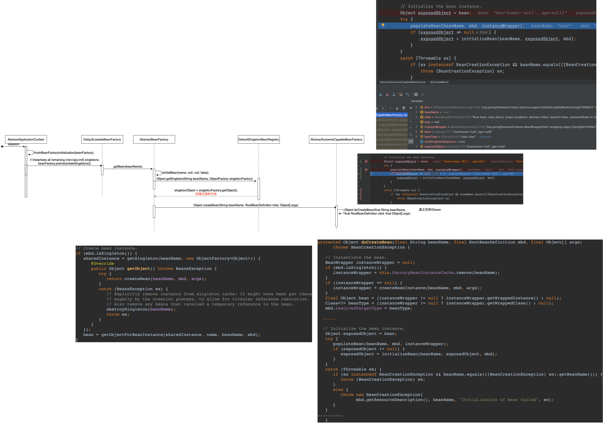
AbstractAutowireCapableBeanFactory类的doCreateBean方法实例化bean参数
###bean的生命周期管理
aware的使用 察觉到

aware是接口  
context.getBean()方法获取到user对象之后，再进行获取对应的Factory怎么拿工厂？  
用aware拿，例如想拿BeanFactory只要实现BeanFactoryAware就行  
BeanFactory类里面有bean的生命周期
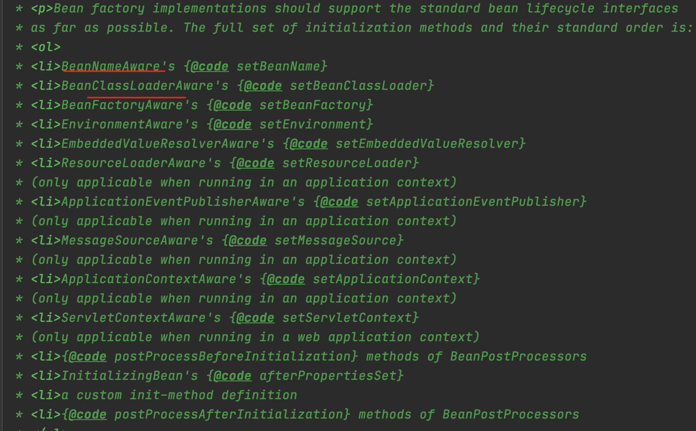
在对象中设置一些aware值 通过setXXX方法能够拿到对应的对象  

###循环依赖问题
构造器的循环依赖是解决不了的 

#####将实例化和初始化分开操作，将实例化好的对象提前暴露出去，可以很轻松的拿到当前对象的引用，只不过当前对象不是一个完整的状态，（实例化完成，单不是初始化完成）


<!--        构造器的循环依赖是解决不了的，没有构造方法会保错name="c"-->

```
    <bean id="b" class="net.gaven.springdemo.iocmyself.readme.springbean.B">
<!--        <property name="c" ref="c"></property>-->
<!--        构造器的循环依赖是解决不了的，没有构造方法会保错name="c"-->
                <constructor-arg name="c" ref="c">
                    
                </constructor-arg>
    </bean>
    <bean id="c" class="net.gaven.springdemo.iocmyself.readme.springbean.C">
        <property name="b" ref="b"></property>
        <!--        <constructor-arg>-->
        <!--            -->
        <!--        </constructor-arg>-->
    </bean>
```
构造器无法解决，因为A依赖B B依赖A  A和B不可能同时通过构造器创建

set方法解决的原因，先实例化（开辟空间）再初始化 设置属性值
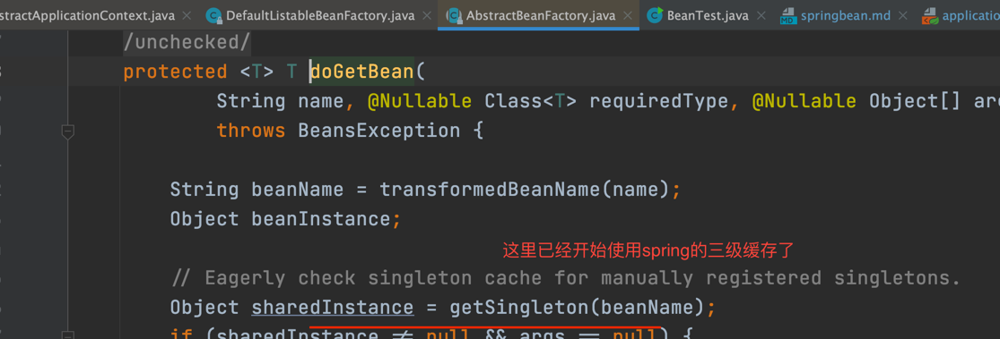
doGetBean  
三级缓存 3个map结构
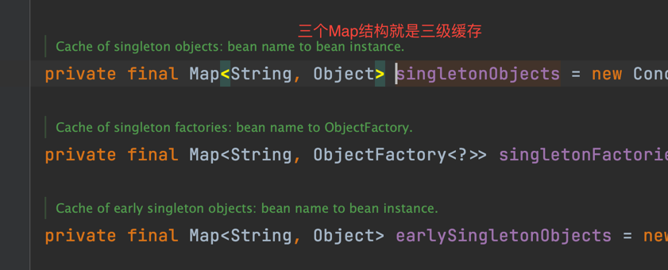
singletonObjects        一级缓存  
earlySingletonObjects   二级缓存  
singletonFactories      三级缓存 b:匿名内部类

1、开始只从一级缓存中获取到数据，之后下面都不走 singletonObject == null && isSingletonCurrentlyInCreation(beanName)true false isSingletonCurrentlyInCreation不满足条件  


###从1级缓存到二级缓存有两个条件
1、对象为空一级缓存为空  
2、当前对象是正在创建中的对象  


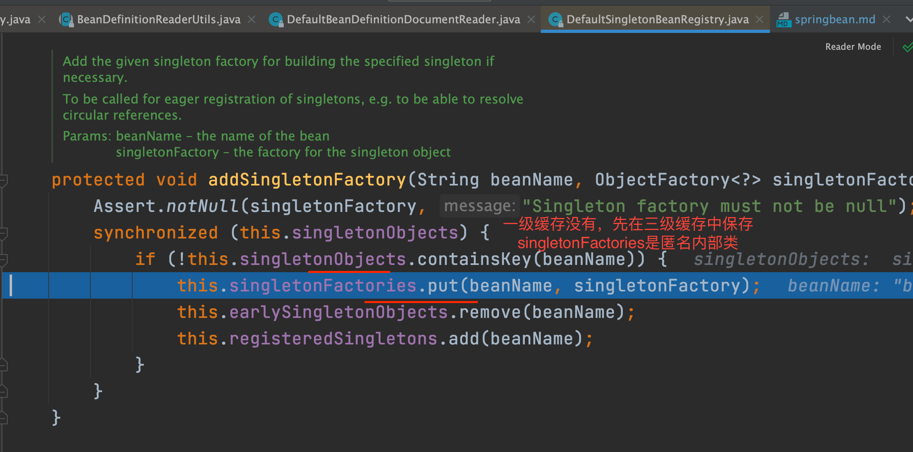
放到了三级缓存
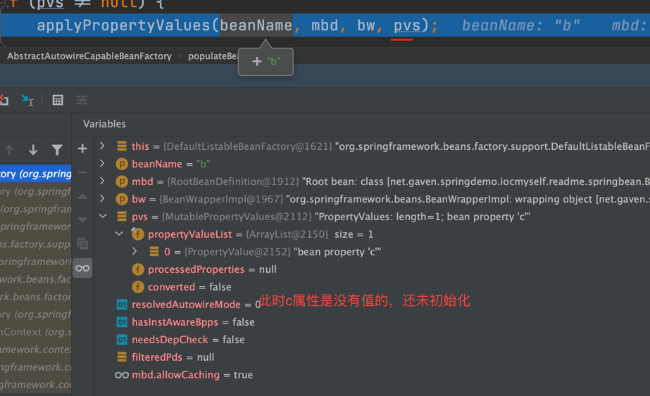 

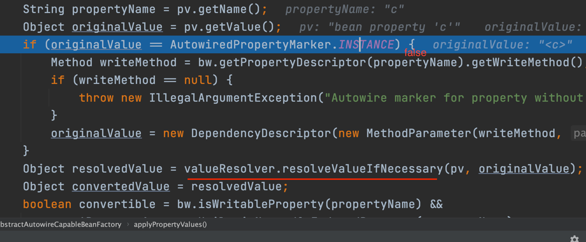
此时的c实例还没初始化，b是引用不到c的

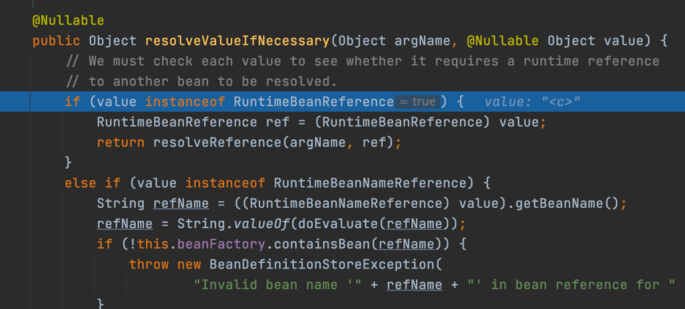
进入到解决的value方法
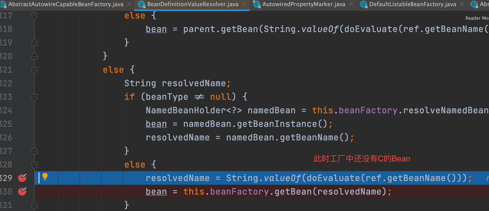
之后又进入到doGetBean方法创建Bean
创建C实例更B到逻辑相同，
singletonFactories      三级缓存 b:匿名内部类 c:匿名内部类

之后执行和B相同到逻辑，

此时会依赖B 但是工厂中还没有B
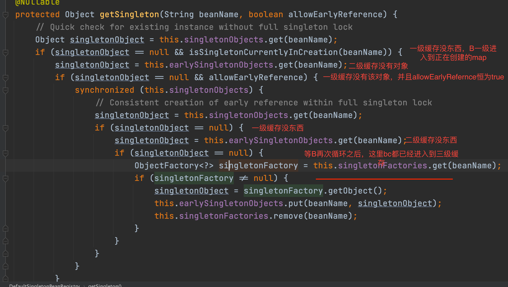


最终的实现
```
protected Object getEarlyBeanReference(String beanName, RootBeanDefinition mbd, Object bean) {
Object exposedObject = bean;
if (!mbd.isSynthetic() && hasInstantiationAwareBeanPostProcessors()) {
for (SmartInstantiationAwareBeanPostProcessor bp : getBeanPostProcessorCache().smartInstantiationAware) {
exposedObject = bp.getEarlyBeanReference(exposedObject, beanName);
}
}
return exposedObject;
}
```
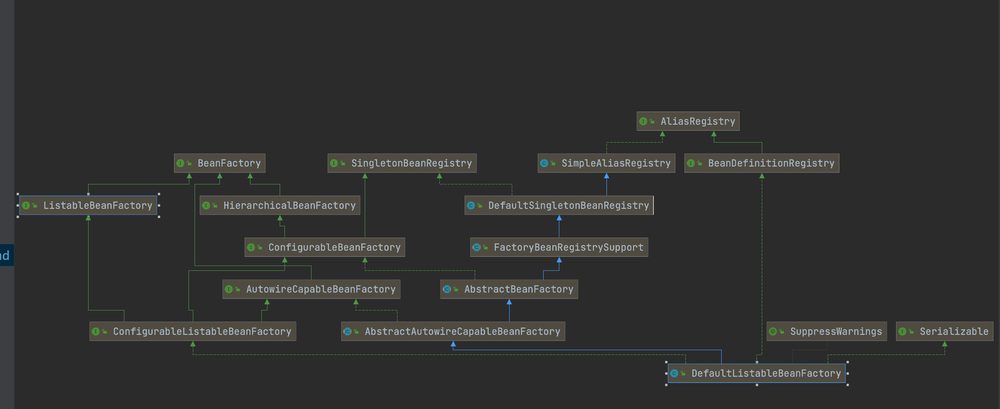


###如果只有一级缓存，能不能解决循环依赖问题？？ 
可以解决，加锁，
一级缓存中村完整对象，线程并发的情况下对singletonObject对象上锁
但是效率会变慢。  
加入新的缓存二级缓存，一级缓存存放完整对象，二级缓存存放半成品（未完成实例化的对象）对二级缓存加锁实现
线程并发访问问题。但是AOP问题两个缓存解决不了
```
addSingletonFactory(beanName, () -> getEarlyBeanReference(beanName, mbd, bean));

看exposedObject = bp.getEarlyBeanReference(exposedObject, beanName);

```
之后看AbstractAutoProxyCreator类的getEarlyBeanReference方法

```
  public Object getEarlyBeanReference(Object bean, String beanName) {
        Object cacheKey = this.getCacheKey(bean.getClass(), beanName);
        this.earlyProxyReferences.put(cacheKey, bean);
        return this.wrapIfNecessary(bean, beanName, cacheKey);
    }
    
        protected Object wrapIfNecessary(Object bean, String beanName, Object cacheKey) {
        if (StringUtils.hasLength(beanName) && this.targetSourcedBeans.contains(beanName)) {
            return bean;
        } else if (Boolean.FALSE.equals(this.advisedBeans.get(cacheKey))) {
            return bean;
        } else if (!this.isInfrastructureClass(bean.getClass()) && !this.shouldSkip(bean.getClass(), beanName)) {
            Object[] specificInterceptors = this.getAdvicesAndAdvisorsForBean(bean.getClass(), beanName, (TargetSource)null);
            if (specificInterceptors != DO_NOT_PROXY) {
                this.advisedBeans.put(cacheKey, Boolean.TRUE);
                Object proxy = this.createProxy(bean.getClass(), beanName, specificInterceptors, new SingletonTargetSource(bean));
                this.proxyTypes.put(cacheKey, proxy.getClass());
                return proxy;
            } else {
                this.advisedBeans.put(cacheKey, Boolean.FALSE);
                return bean;
            }
        } else {
            this.advisedBeans.put(cacheKey, Boolean.FALSE);
            return bean;
        }
    }
```
```
if (specificInterceptors != DO_NOT_PROXY) {
                this.advisedBeans.put(cacheKey, Boolean.TRUE);
                Object proxy = this.createProxy(bean.getClass(), beanName, specificInterceptors, new SingletonTargetSource(bean));
                this.proxyTypes.put(cacheKey, proxy.getClass());
                return proxy;
            } 
```
这里是动态代理的实现方式，
```
                Object proxy = this.createProxy(bean.getClass(), beanName, specificInterceptors, new SingletonTargetSource(bean));

```
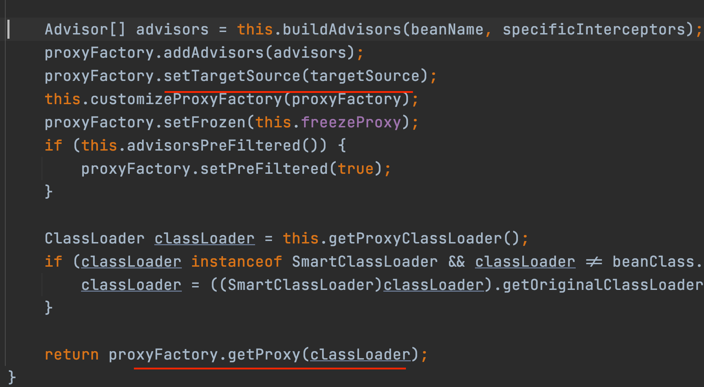
这里通过proxyFactory重新生成一个新的对象，和原来的对象没有关系了
如果没有三级缓存，刚开始方的是实例化好的对象，然后缓存中有了，后面进行代理处理，然后生成了一个代理类。。。两个东西不是一个对象，创建了两个对象
FactoryObject（匿名内部类最终生成的是一个统一的对象）


AOP在哪找，BeanPostProcessor接口里面有两个方法，看下一个方法  

@Nullable
default Object postProcessAfterInitialization(Object bean, String beanName) throws BeansException {
return bean;
}
实现类AbstractAutoProxyCreator
最终AOP
```
public Object postProcessAfterInitialization(@Nullable Object bean, String beanName) {
        if (bean != null) {
            Object cacheKey = this.getCacheKey(bean.getClass(), beanName);
            if (this.earlyProxyReferences.remove(cacheKey) != bean) {
                return this.wrapIfNecessary(bean, beanName, cacheKey);
            }
        }

        return bean;
    }

```
这里的**wrapIfNecessary**方法是主要方法AOP最终都会生成代理对象的。
想看AOP先看JDK和cglib的动态代理

二级缓存存放


