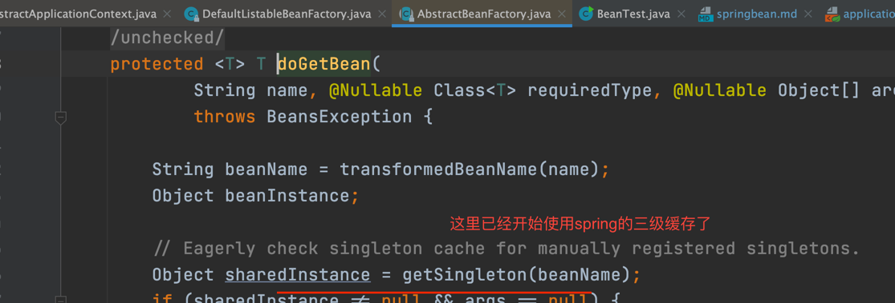
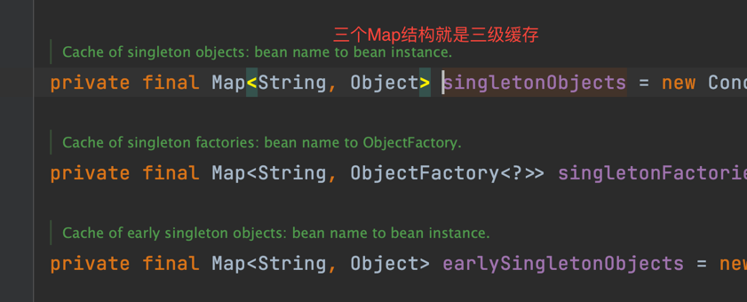
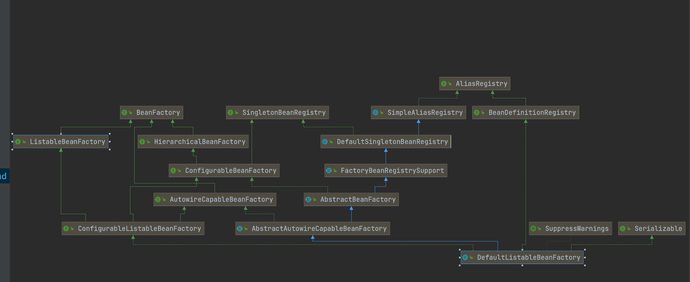

##Spring Bean

接上次spring的md
###bean的初始化

在哪bean实例化完成之后，需要对bean的属性进行初始化操作，  
初始化操作的方法是如下，

AbstractAutowireCapableBeanFactory类的doCreateBean方法实例化bean参数
###bean的生命周期管理
aware的使用 察觉到

aware是接口  
context.getBean()方法获取到user对象之后，再进行获取对应的Factory怎么拿工厂？  
用aware拿，例如想拿BeanFactory只要实现BeanFactoryAware就行  
BeanFactory类里面有bean的生命周期

在对象中设置一些aware值 通过setXXX方法能够拿到对应的对象  

###循环依赖问题
构造器的循环依赖是解决不了的
<!--        构造器的循环依赖是解决不了的，没有构造方法会保错name="c"-->

```
    <bean id="b" class="net.gaven.springdemo.iocmyself.readme.springbean.B">
<!--        <property name="c" ref="c"></property>-->
<!--        构造器的循环依赖是解决不了的，没有构造方法会保错name="c"-->
                <constructor-arg name="c" ref="c">
                    
                </constructor-arg>
    </bean>
    <bean id="c" class="net.gaven.springdemo.iocmyself.readme.springbean.C">
        <property name="b" ref="b"></property>
        <!--        <constructor-arg>-->
        <!--            -->
        <!--        </constructor-arg>-->
    </bean>
```
构造器无法解决，因为A依赖B B依赖A  A和B不可能同时通过构造器创建

set方法解决的原因，先实例化（开辟空间）再初始化 设置属性值

doGetBean  
三级缓存 3个map结构

singletonObjects        一级缓存
earlySingletonObjects   二级缓存
singletonFactories      三级缓存

1、开始只从一级缓存中获取到数据，之后下面都不走 singletonObject == null && isSingletonCurrentlyInCreation(beanName)true false isSingletonCurrentlyInCreation不满足条件  


###从1级缓存到二级缓存有两个条件
1、对象为空一级缓存为空  
2、当前对象是正在创建中的对象  





