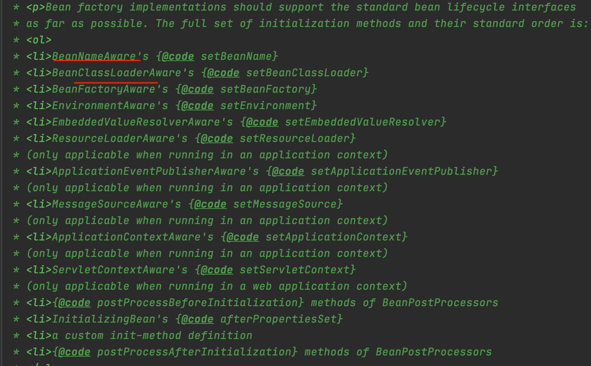

##Spring Bean

接上次spring的md
###bean的初始化

在哪bean实例化完成之后，需要对bean的属性进行初始化操作，  
初始化操作的方法是如下，

AbstractAutowireCapableBeanFactory类的doCreateBean方法实例化bean参数
###bean的生命周期管理
aware的使用 察觉到

aware是接口  
context.getBean()方法获取到user对象之后，再进行获取对应的Factory怎么拿工厂？  
用aware拿，例如想拿BeanFactory只要实现BeanFactoryAware就行  
BeanFactory类里面有bean的生命周期

在对象中设置一些aware值 通过setXXX方法能够拿到对应的对象  

