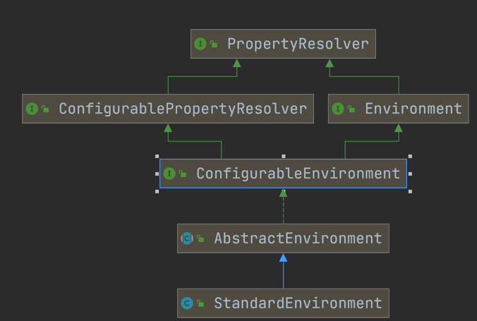
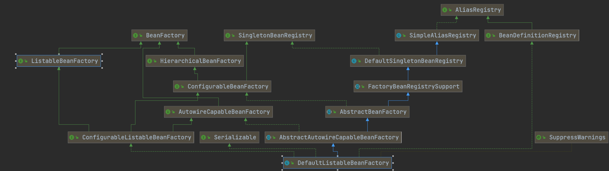
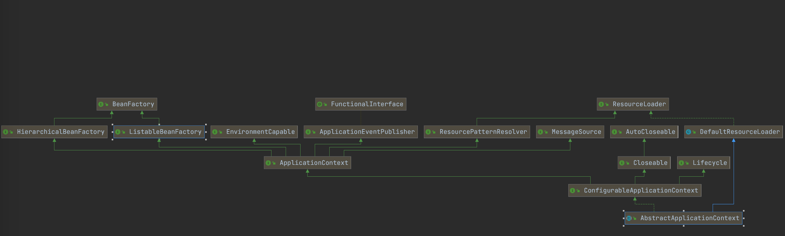
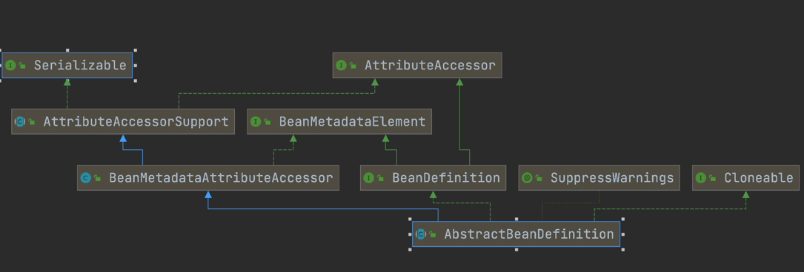

###iocmyself 自定义实现注解 + spring源码读取笔记

###prepareloadpropertiesbeforestart 项目启动之前进行加载的实现方法

###mybeanfactorypostprocessor BeanFactoryPostProcessor的使用方法

### reflection 扫描全包的方法 Reflection工具的使用

###spring中的一些继承和实现关系

standardEnvironment 是prepareRefresh()方法创建的环境，如果private ConfigurableEnvironment environment;
environment为空则创建一个标准的环境  
**PropertySource：属性源。**    key-value属性对抽象   

**PropertyResolver：属性解析器。** 用于解析相应key的value

DefaultListableBeanFactory  
BeanFactory只是一个接口，我们最终需要一个该接口的实现来进行实际的Bean的管理，DefaultListableBeanFactory就是这么一个比较通用的BeanFactory实现类。
DefaultListableBeanFactory除了间接地实现了BeanFactory接口，还实现了BeanDefinitionRegistry接口，该接口才
是在BeanFactory的实现中担当Bean注册管理的角色。基本上，BeanFactory接口只定义如何访问容
器内管理的Bean的方法，各个BeanFactory的具体实现类负责具体Bean的注册以及管理工作。
BeanDefinitionRegistry接口定义抽象了Bean的注册逻辑。通常情况下，具体的BeanFactory实现
// Tell the subclass to refresh the internal bean factory.
ConfigurableListableBeanFactory beanFactory = obtainFreshBeanFactory();
创建的默认工厂
AbstractRefreshableApplicationContext创建  

###BeanDefinition

###BeanDefinitionRegistry
Interface for registries that hold bean definitions, for example RootBeanDefinition and ChildBeanDefinition instances. Typically implemented by BeanFactories that internally work with the AbstractBeanDefinition hierarchy.
This is the only interface in Spring's bean factory packages that encapsulates （封装）registration of bean definitions. The standard BeanFactory interfaces only cover access to a fully configured factory instance.
Spring's bean definition readers expect to work on an implementation of this interface. Known implementors within the Spring core are DefaultListableBeanFactory and GenericApplicationContext
BeanDefinitionRegistry就像图书馆的书架，所有的书是放在书架上的。   
虽然你
还书或者借书都是跟图书馆（也就是BeanFactory，或许BookFactory可能更好些）打交道，但书架才
是图书馆存放各类图书的地方。所以，书架相对于图书馆来说，就是它的“BookDefinitionRegistry”。
