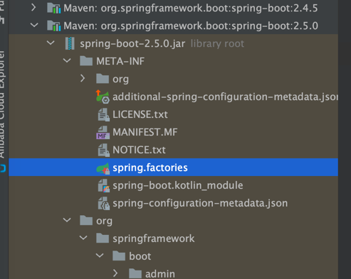
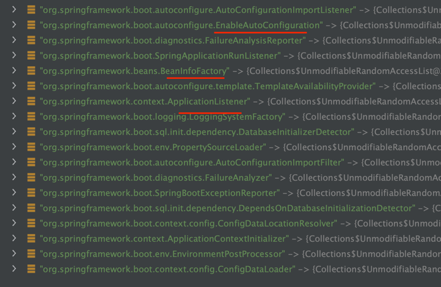
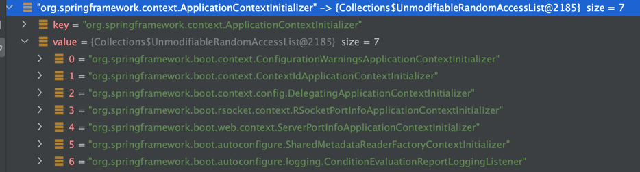
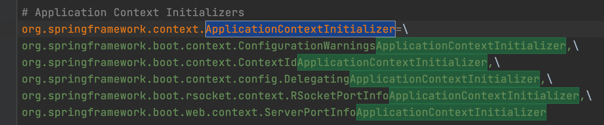
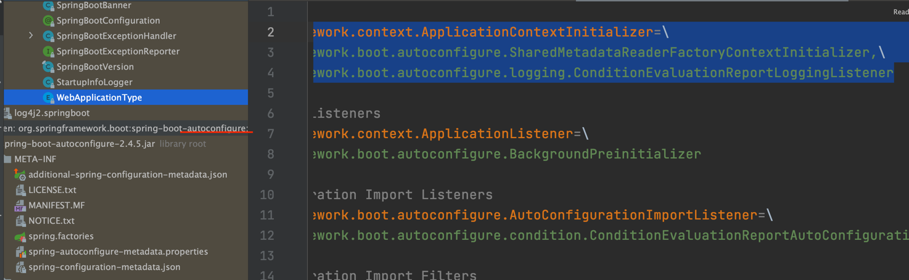
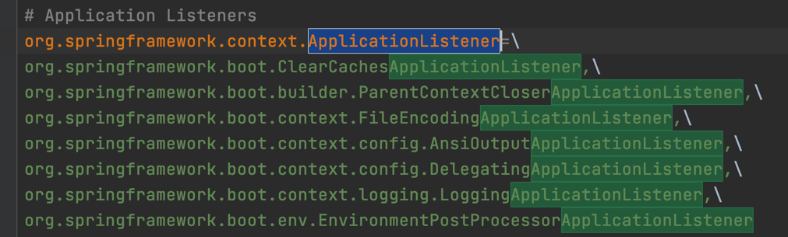
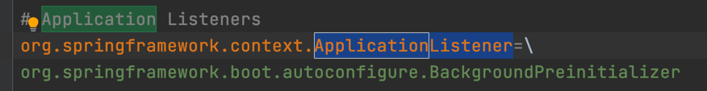
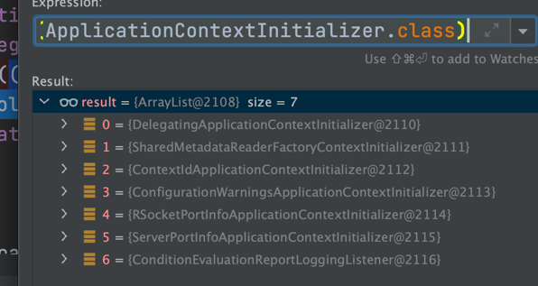
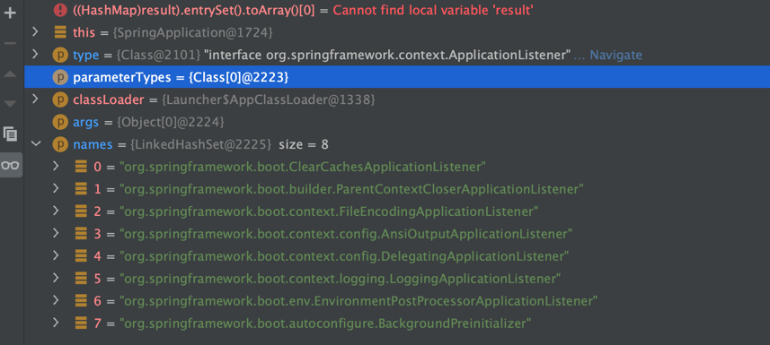

# Getting Started

### Reference Documentation

For further reference, please consider the following sections:

* [Official Apache Maven documentation](https://maven.apache.org/guides/index.html)
* [Spring Boot Maven Plugin Reference Guide](https://docs.spring.io/spring-boot/docs/2.5.0/maven-plugin/reference/html/)
* [Create an OCI image](https://docs.spring.io/spring-boot/docs/2.5.0/maven-plugin/reference/html/#build-image)
* [Spring Web](https://docs.spring.io/spring-boot/docs/2.5.0/reference/htmlsingle/#boot-features-developing-web-applications)

### Guides

The following guides illustrate how to use some features concretely:

* [Building a RESTful Web Service](https://spring.io/guides/gs/rest-service/)
* [Serving Web Content with Spring MVC](https://spring.io/guides/gs/serving-web-content/)
* [Building REST services with Spring](https://spring.io/guides/tutorials/bookmarks/)
  
## springboot
springboot是一个脚手架，让配置等通过程序自动加载，无需自己手动配置，开箱即用  
不同时间做什么事情，实现的方式---监听器  

  

###1、IOC

启动时构造
```
//primarySources就是SpringbootApplication当前的启动类

public SpringApplication(ResourceLoader resourceLoader, Class<?>... primarySources) {
this.resourceLoader = resourceLoader;
Assert.notNull(primarySources, "PrimarySources must not be null");
this.primarySources = new LinkedHashSet<>(Arrays.asList(primarySources));
//servlet类型的应用
this.webApplicationType = WebApplicationType.deduceFromClasspath();
this.bootstrapRegistryInitializers = getBootstrapRegistryInitializersFromSpringFactories();
setInitializers((Collection) getSpringFactoriesInstances(ApplicationContextInitializer.class));
setListeners((Collection) getSpringFactoriesInstances(ApplicationListener.class));
this.mainApplicationClass = deduceMainApplicationClass();
}
```
```
		setInitializers((Collection) getSpringFactoriesInstances(ApplicationContextInitializer.class));
		setListeners((Collection) getSpringFactoriesInstances(ApplicationListener.class));
```
上面两个是核心代码
###设置初始化器
getSpringFactoriesInstances是两个同样的方法，这样一定是抽象的方法--》不同的实现  

```
	private <T> Collection<T> getSpringFactoriesInstances(Class<T> type, Class<?>[] parameterTypes, Object... args) {
		ClassLoader classLoader = getClassLoader();
		// Use names and ensure unique to protect against duplicates
		Set<String> names = new LinkedHashSet<>(SpringFactoriesLoader.loadFactoryNames(type, classLoader));
		List<T> instances = createSpringFactoriesInstances(type, parameterTypes, classLoader, args, names);
		AnnotationAwareOrderComparator.sort(instances);
		return instances;
	}
```
SpringFactoriesLoader.loadFactoryNames(type, classLoader)方法非常重要
Load the fully qualified class names of factory implementations of the given type from "META-INF/spring.factories", using the given class loader.
As of Spring Framework 5.3, if a particular implementation class name is discovered more than once for the given factory type, duplicates will be ignored.
注解的意思为 通过给订的加载器去（AppClassLoader）加载实现了META-INF/spring.factories下的全部全类名的类，重复加载的会被忽略
加载配置的类工厂
在当前类的路径下找到了该配置文件

```
# Logging Systems
org.springframework.boot.logging.LoggingSystemFactory=\
org.springframework.boot.logging.logback.LogbackLoggingSystem.Factory,\
org.springframework.boot.logging.log4j2.Log4J2LoggingSystem.Factory,\
org.springframework.boot.logging.java.JavaLoggingSystem.Factory

# PropertySource Loaders
org.springframework.boot.env.PropertySourceLoader=\
org.springframework.boot.env.PropertiesPropertySourceLoader,\
org.springframework.boot.env.YamlPropertySourceLoader

# ConfigData Location Resolvers
org.springframework.boot.context.config.ConfigDataLocationResolver=\
org.springframework.boot.context.config.ConfigTreeConfigDataLocationResolver,\
org.springframework.boot.context.config.StandardConfigDataLocationResolver

# ConfigData Loaders
org.springframework.boot.context.config.ConfigDataLoader=\
org.springframework.boot.context.config.ConfigTreeConfigDataLoader,\
org.springframework.boot.context.config.StandardConfigDataLoader

# Run Listeners
org.springframework.boot.SpringApplicationRunListener=\
org.springframework.boot.context.event.EventPublishingRunListener

# Error Reporters
org.springframework.boot.SpringBootExceptionReporter=\
org.springframework.boot.diagnostics.FailureAnalyzers

# Application Context Initializers
org.springframework.context.ApplicationContextInitializer=\
org.springframework.boot.context.ConfigurationWarningsApplicationContextInitializer,\
org.springframework.boot.context.ContextIdApplicationContextInitializer,\
org.springframework.boot.context.config.DelegatingApplicationContextInitializer,\
org.springframework.boot.rsocket.context.RSocketPortInfoApplicationContextInitializer,\
org.springframework.boot.web.context.ServerPortInfoApplicationContextInitializer

# Application Listeners
org.springframework.context.ApplicationListener=\
org.springframework.boot.ClearCachesApplicationListener,\
org.springframework.boot.builder.ParentContextCloserApplicationListener,\
org.springframework.boot.context.FileEncodingApplicationListener,\
org.springframework.boot.context.config.AnsiOutputApplicationListener,\
org.springframework.boot.context.config.DelegatingApplicationListener,\
org.springframework.boot.context.logging.LoggingApplicationListener,\
org.springframework.boot.env.EnvironmentPostProcessorApplicationListener

# Environment Post Processors
org.springframework.boot.env.EnvironmentPostProcessor=\
org.springframework.boot.cloud.CloudFoundryVcapEnvironmentPostProcessor,\
org.springframework.boot.context.config.ConfigDataEnvironmentPostProcessor,\
org.springframework.boot.env.RandomValuePropertySourceEnvironmentPostProcessor,\
org.springframework.boot.env.SpringApplicationJsonEnvironmentPostProcessor,\
org.springframework.boot.env.SystemEnvironmentPropertySourceEnvironmentPostProcessor,\
org.springframework.boot.reactor.DebugAgentEnvironmentPostProcessor

# Failure Analyzers
org.springframework.boot.diagnostics.FailureAnalyzer=\
org.springframework.boot.context.config.ConfigDataNotFoundFailureAnalyzer,\
org.springframework.boot.context.properties.IncompatibleConfigurationFailureAnalyzer,\
org.springframework.boot.context.properties.NotConstructorBoundInjectionFailureAnalyzer,\
org.springframework.boot.diagnostics.analyzer.BeanCurrentlyInCreationFailureAnalyzer,\
org.springframework.boot.diagnostics.analyzer.BeanDefinitionOverrideFailureAnalyzer,\
org.springframework.boot.diagnostics.analyzer.BeanNotOfRequiredTypeFailureAnalyzer,\
org.springframework.boot.diagnostics.analyzer.BindFailureAnalyzer,\
org.springframework.boot.diagnostics.analyzer.BindValidationFailureAnalyzer,\
org.springframework.boot.diagnostics.analyzer.UnboundConfigurationPropertyFailureAnalyzer,\
org.springframework.boot.diagnostics.analyzer.ConnectorStartFailureAnalyzer,\
org.springframework.boot.diagnostics.analyzer.NoSuchMethodFailureAnalyzer,\
org.springframework.boot.diagnostics.analyzer.NoUniqueBeanDefinitionFailureAnalyzer,\
org.springframework.boot.diagnostics.analyzer.PortInUseFailureAnalyzer,\
org.springframework.boot.diagnostics.analyzer.ValidationExceptionFailureAnalyzer,\
org.springframework.boot.diagnostics.analyzer.InvalidConfigurationPropertyNameFailureAnalyzer,\
org.springframework.boot.diagnostics.analyzer.InvalidConfigurationPropertyValueFailureAnalyzer,\
org.springframework.boot.diagnostics.analyzer.PatternParseFailureAnalyzer,\
org.springframework.boot.liquibase.LiquibaseChangelogMissingFailureAnalyzer

# Failure Analysis Reporters
org.springframework.boot.diagnostics.FailureAnalysisReporter=\
org.springframework.boot.diagnostics.LoggingFailureAnalysisReporter

# Database Initializer Detectors
org.springframework.boot.sql.init.dependency.DatabaseInitializerDetector=\
org.springframework.boot.flyway.FlywayDatabaseInitializerDetector,\
org.springframework.boot.jdbc.init.DataSourceScriptDatabaseInitializerDetector,\
org.springframework.boot.liquibase.LiquibaseDatabaseInitializerDetector,\
org.springframework.boot.orm.jpa.JpaDatabaseInitializerDetector,\
org.springframework.boot.r2dbc.init.R2dbcScriptDatabaseInitializerDetector

# Depends On Database Initialization Detectors
org.springframework.boot.sql.init.dependency.DependsOnDatabaseInitializationDetector=\
org.springframework.boot.sql.init.dependency.AnnotationDependsOnDatabaseInitializationDetector,\
org.springframework.boot.jdbc.SpringJdbcDependsOnDatabaseInitializationDetector,\
org.springframework.boot.jooq.JooqDependsOnDatabaseInitializationDetector,\
org.springframework.boot.orm.jpa.JpaDependsOnDatabaseInitializationDetector

```
上面都是springboot的一些核心的配置  
下面看一下是如何进行加载的
```
private static Map<String, List<String>> loadSpringFactories(ClassLoader classLoader) {
		//@step1 从缓存中加载
		Map<String, List<String>> result = cache.get(classLoader);
		if (result != null) {
			return result;
		}
    
		result = new HashMap<>();
		try {
		
			Enumeration<URL> urls = classLoader.getResources(FACTORIES_RESOURCE_LOCATION);
			while (urls.hasMoreElements()) {
				URL url = urls.nextElement();
				UrlResource resource = new UrlResource(url);
				Properties properties = PropertiesLoaderUtils.loadProperties(resource);
				for (Map.Entry<?, ?> entry : properties.entrySet()) {
					String factoryTypeName = ((String) entry.getKey()).trim();
					String[] factoryImplementationNames =
							StringUtils.commaDelimitedListToStringArray((String) entry.getValue());
					for (String factoryImplementationName : factoryImplementationNames) {
						result.computeIfAbsent(factoryTypeName, key -> new ArrayList<>())
								.add(factoryImplementationName.trim());
					}
				}
			}

			// Replace all lists with unmodifiable lists containing unique elements
			result.replaceAll((factoryType, implementations) -> implementations.stream().distinct()
					.collect(Collectors.collectingAndThen(Collectors.toList(), Collections::unmodifiableList)));
			cache.put(classLoader, result);
		}
		catch (IOException ex) {
			throw new IllegalArgumentException("Unable to load factories from location [" +
					FACTORIES_RESOURCE_LOCATION + "]", ex);
		}
		return result;
	}
```
缓存
static final Map<ClassLoader, Map<String, List<String>>> cache = new ConcurrentReferenceHashMap<>();

Enumeration<URL> urls = classLoader.getResources(FACTORIES_RESOURCE_LOCATION);
**这个方法是加载 FACTORIES_RESOURCE_LOCATION = "META-INF/spring.factories"下的配置文件**
	加载之后的结果如下

那这些结果是怎么来的呢，与之前的配置文件有什么关系？？
  
ApplicationContextInitializer中有7个META-INF/spring.factories中的ApplicationContextInitializer属性下的一样，由此可以猜测是通过前面传的
这7个当中，其中前5个与



这个自动配置META-INF/spring.factories的下面还有两个

正好加起来是7个扫描的ApplicationContextInitializer下的属性配置，
自动配置类下有7个 core包下有13个其中有两个重复的
猜想：：两个配置文件下的类名加起来正好是result这18个结果 



ApplicationListener和ApplicationContextInitializer


((Collection) getSpringFactoriesInstances(ApplicationContextInitializer.class))这个方法正好返回7个与之前的相同
那么这些result是如果被加载出来的的呢？继续跟源码发现有下面一个方法

```
private <T> List<T> createSpringFactoriesInstances(Class<T> type, Class<?>[] parameterTypes,
			ClassLoader classLoader, Object[] args, Set<String> names) {
		List<T> instances = new ArrayList<>(names.size());
		for (String name : names) {
			try {
				Class<?> instanceClass = ClassUtils.forName(name, classLoader);
				Assert.isAssignable(type, instanceClass);
				Constructor<?> constructor = instanceClass.getDeclaredConstructor(parameterTypes);
				T instance = (T) BeanUtils.instantiateClass(constructor, args);
				instances.add(instance);
			}
			catch (Throwable ex) {
				throw new IllegalArgumentException("Cannot instantiate " + type + " : " + name, ex);
			}
		}
		return instances;
	}
```

通过反射根据这些names拿到clazz创建实例

setInitializers((Collection) getSpringFactoriesInstances(ApplicationContextInitializer.class))  
跟到这还是有个疑问？？为什么会到两个spring.factory文件下读取配置？？
**实际上如果有多个META-INF/spring.factories文件springboot会到每一个classpath下的META-INF/spring.factories下的配置文件加载读取**  
这里只是取出类包名+类名的全限定名称，并未进行其他操作（实例化）之后方便进行实例化class.forName()
后续会通过createSpringFactoriesInstances方法实例化操作


###设置监听器


###2、AOP
AOP就是从BeanPostProcessor那进入的  


spring是BeanFactoryPostProcessor
###3、
###4、
###5、
###6、
###7、
###8、
###9、


