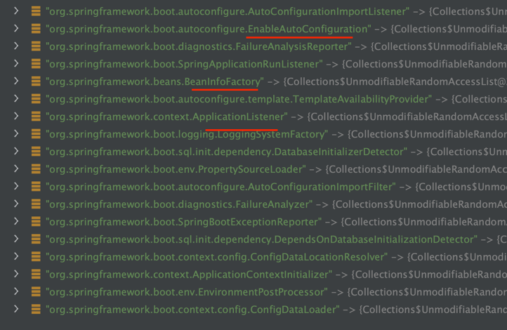
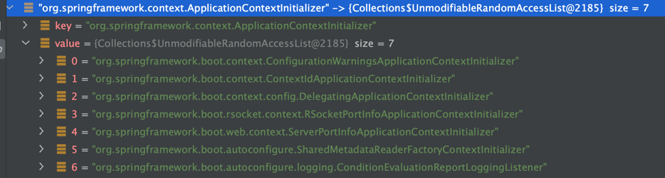
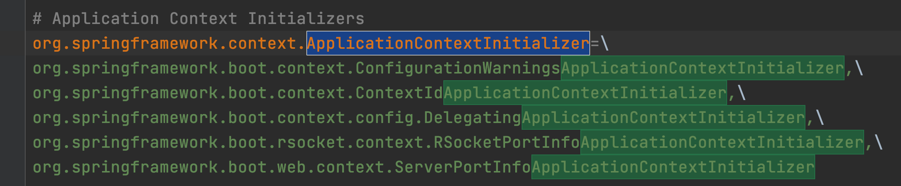
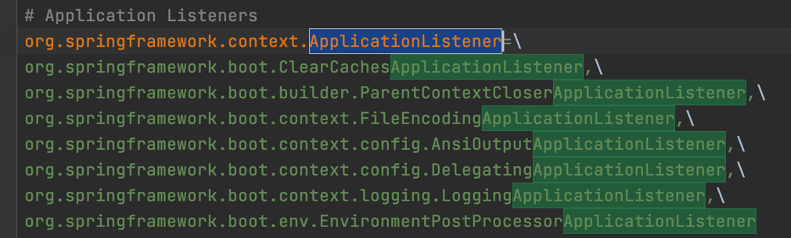
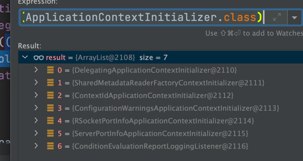
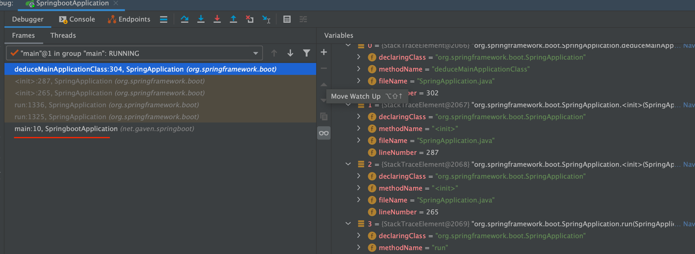
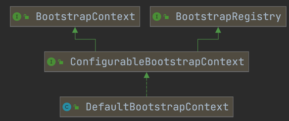

# Getting Started

### Reference Documentation

For further reference, please consider the following sections:

* [Official Apache Maven documentation](https://maven.apache.org/guides/index.html)
* [Spring Boot Maven Plugin Reference Guide](https://docs.spring.io/spring-boot/docs/2.5.0/maven-plugin/reference/html/)
* [Create an OCI image](https://docs.spring.io/spring-boot/docs/2.5.0/maven-plugin/reference/html/#build-image)
* [Spring Web](https://docs.spring.io/spring-boot/docs/2.5.0/reference/htmlsingle/#boot-features-developing-web-applications)

### Guides

The following guides illustrate how to use some features concretely:

* [Building a RESTful Web Service](https://spring.io/guides/gs/rest-service/)
* [Serving Web Content with Spring MVC](https://spring.io/guides/gs/serving-web-content/)
* [Building REST services with Spring](https://spring.io/guides/tutorials/bookmarks/)
  
## springboot
springboot是一个脚手架，让配置等通过程序自动加载，无需自己手动配置，开箱即用  
不同时间做什么事情，实现的方式---监听器  

  

###1、构造SpringApplication

启动时构造
```
//primarySources就是SpringbootApplication当前的启动类

public SpringApplication(ResourceLoader resourceLoader, Class<?>... primarySources) {
this.resourceLoader = resourceLoader;
Assert.notNull(primarySources, "PrimarySources must not be null");
this.primarySources = new LinkedHashSet<>(Arrays.asList(primarySources));
//servlet类型的应用
this.webApplicationType = WebApplicationType.deduceFromClasspath();
this.bootstrapRegistryInitializers = getBootstrapRegistryInitializersFromSpringFactories();
setInitializers((Collection) getSpringFactoriesInstances(ApplicationContextInitializer.class));
setListeners((Collection) getSpringFactoriesInstances(ApplicationListener.class));
this.mainApplicationClass = deduceMainApplicationClass();
}
```
```
		setInitializers((Collection) getSpringFactoriesInstances(ApplicationContextInitializer.class));
		setListeners((Collection) getSpringFactoriesInstances(ApplicationListener.class));
```
上面两个是核心代码
###设置初始化器
getSpringFactoriesInstances是两个同样的方法，这样一定是抽象的方法--》不同的实现  

```
	private <T> Collection<T> getSpringFactoriesInstances(Class<T> type, Class<?>[] parameterTypes, Object... args) {
		ClassLoader classLoader = getClassLoader();
		// Use names and ensure unique to protect against duplicates
		Set<String> names = new LinkedHashSet<>(SpringFactoriesLoader.loadFactoryNames(type, classLoader));
		List<T> instances = createSpringFactoriesInstances(type, parameterTypes, classLoader, args, names);
		AnnotationAwareOrderComparator.sort(instances);
		return instances;
	}
```
SpringFactoriesLoader.loadFactoryNames(type, classLoader)方法非常重要
Load the fully qualified class names of factory implementations of the given type from "META-INF/spring.factories", using the given class loader.
As of Spring Framework 5.3, if a particular implementation class name is discovered more than once for the given factory type, duplicates will be ignored.
注解的意思为 通过给订的加载器去（AppClassLoader）加载实现了META-INF/spring.factories下的全部全类名的类，重复加载的会被忽略
加载配置的类工厂
在当前类的路径下找到了该配置文件

```
# Logging Systems
org.springframework.boot.logging.LoggingSystemFactory=\
org.springframework.boot.logging.logback.LogbackLoggingSystem.Factory
# PropertySource Loaders
org.springframework.boot.env.PropertySourceLoader=\
org.springframework.boot.env.PropertiesPropertySourceLoader,\
org.springframework.boot.env.YamlPropertySourceLoader

org.springframework.boot.orm.jpa.JpaDependsOnDatabaseInitializationDetector

```
上面都是springboot的一些核心的配置  
下面看一下是如何进行加载的
```
private static Map<String, List<String>> loadSpringFactories(ClassLoader classLoader) {
		//@step1 从缓存中加载
		Map<String, List<String>> result = cache.get(classLoader);
		if (result != null) {
			return result;
		}
    
		result = new HashMap<>();
		try {
		
			Enumeration<URL> urls = classLoader.getResources(FACTORIES_RESOURCE_LOCATION);
			while (urls.hasMoreElements()) {
				URL url = urls.nextElement();
				UrlResource resource = new UrlResource(url);
				Properties properties = PropertiesLoaderUtils.loadProperties(resource);
				for (Map.Entry<?, ?> entry : properties.entrySet()) {
					String factoryTypeName = ((String) entry.getKey()).trim();
					String[] factoryImplementationNames =
							StringUtils.commaDelimitedListToStringArray((String) entry.getValue());
					for (String factoryImplementationName : factoryImplementationNames) {
						result.computeIfAbsent(factoryTypeName, key -> new ArrayList<>())
								.add(factoryImplementationName.trim());
					}
				}
			}

			// Replace all lists with unmodifiable lists containing unique elements
			result.replaceAll((factoryType, implementations) -> implementations.stream().distinct()
					.collect(Collectors.collectingAndThen(Collectors.toList(), Collections::unmodifiableList)));
			cache.put(classLoader, result);
		}
		catch (IOException ex) {
			throw new IllegalArgumentException("Unable to load factories from location [" +
					FACTORIES_RESOURCE_LOCATION + "]", ex);
		}
		return result;
	}
```
缓存
static final Map<ClassLoader, Map<String, List<String>>> cache = new ConcurrentReferenceHashMap<>();

Enumeration<URL> urls = classLoader.getResources(FACTORIES_RESOURCE_LOCATION);
**这个方法是加载 FACTORIES_RESOURCE_LOCATION = "META-INF/spring.factories"下的配置文件**
	加载之后的结果如下

那这些结果是怎么来的呢，与之前的配置文件有什么关系？？
  
ApplicationContextInitializer中有7个META-INF/spring.factories中的ApplicationContextInitializer属性下的一样，由此可以猜测是通过前面传的
这7个当中，其中前5个与



这个自动配置META-INF/spring.factories的下面还有两个

正好加起来是7个扫描的ApplicationContextInitializer下的属性配置，
自动配置类下有7个 core包下有13个其中有两个重复的
猜想：：两个配置文件下的类名加起来正好是result这18个结果 



ApplicationListener和ApplicationContextInitializer


((Collection) getSpringFactoriesInstances(ApplicationContextInitializer.class))这个方法正好返回7个与之前的相同
那么这些result是如果被加载出来的的呢？继续跟源码发现有下面一个方法

```
private <T> List<T> createSpringFactoriesInstances(Class<T> type, Class<?>[] parameterTypes,
			ClassLoader classLoader, Object[] args, Set<String> names) {
		List<T> instances = new ArrayList<>(names.size());
		for (String name : names) {
			try {
				Class<?> instanceClass = ClassUtils.forName(name, classLoader);
				Assert.isAssignable(type, instanceClass);
				Constructor<?> constructor = instanceClass.getDeclaredConstructor(parameterTypes);
				T instance = (T) BeanUtils.instantiateClass(constructor, args);
				instances.add(instance);
			}
			catch (Throwable ex) {
				throw new IllegalArgumentException("Cannot instantiate " + type + " : " + name, ex);
			}
		}
		return instances;
	}
```

通过反射根据这些names拿到clazz创建实例

setInitializers((Collection) getSpringFactoriesInstances(ApplicationContextInitializer.class))  
跟到这还是有个疑问？？为什么会到两个spring.factory文件下读取配置？？
**实际上如果有多个META-INF/spring.factories文件springboot会到每一个classpath下的META-INF/spring.factories下的配置文件加载读取** 对应的jar包都会放到classpath路径下。  

这里只是取出类包名+类名的全限定名称，并未进行其他操作（实例化）之后方便进行实例化class.forName()
后续会通过createSpringFactoriesInstances方法实例化操作

之后通过堆栈信息找到main方法所在的类，实例化

```
xprivate Class<?> deduceMainApplicationClass() {
		try {
			StackTraceElement[] stackTrace = new RuntimeException().getStackTrace();
			for (StackTraceElement stackTraceElement : stackTrace) {
				if ("main".equals(stackTraceElement.getMethodName())) {
					return Class.forName(stackTraceElement.getClassName());
				}
			}
		}
		catch (ClassNotFoundException ex) {
			// Swallow and continue
		}
		return null;
	}
```

Class<?> mainApplicationClass = deduceMainApplicationClass();最后返回Class<?>字节码对象
###2执行SpringApplication的run方法
return new SpringApplication(primarySources).run(args);
```
public ConfigurableApplicationContext run(String... args) {
		StopWatch stopWatch = new StopWatch();
		stopWatch.start();
		//创建引导上下文，创建了一个默认的引导上下文
		DefaultBootstrapContext bootstrapContext = createBootstrapContext();
		ConfigurableApplicationContext context = null;
		configureHeadlessProperty();
		SpringApplicationRunListeners listeners = getRunListeners(args);
		listeners.starting(bootstrapContext, this.mainApplicationClass);
		try {
			ApplicationArguments applicationArguments = new DefaultApplicationArguments(args);
			ConfigurableEnvironment environment = prepareEnvironment(listeners, bootstrapContext, applicationArguments);
			configureIgnoreBeanInfo(environment);
			Banner printedBanner = printBanner(environment);
			context = createApplicationContext();
			context.setApplicationStartup(this.applicationStartup);
			prepareContext(bootstrapContext, context, environment, listeners, applicationArguments, printedBanner);
			refreshContext(context);
			afterRefresh(context, applicationArguments);
			stopWatch.stop();
			if (this.logStartupInfo) {
				new StartupInfoLogger(this.mainApplicationClass).logStarted(getApplicationLog(), stopWatch);
			}
			listeners.started(context);
			callRunners(context, applicationArguments);
		}
		catch (Throwable ex) {
			handleRunFailure(context, ex, listeners);
			throw new IllegalStateException(ex);
		}

		try {
			listeners.running(context);
		}
		catch (Throwable ex) {
			handleRunFailure(context, ex, null);
			throw new IllegalStateException(ex);
		}
		return context;
	}
```
run方法就是核心代码了，这里需要好好的研究  
JDK1.6之前需要配置path和classpath classpath需要配置rt.jar和tools.jar  
设计思路，无非是设置初始化属性，

######（1）设置启动时间
StopWatch stopWatch = new StopWatch();
stopWatch.start();
记录程序的启动时间
```
public void start(String taskName) throws IllegalStateException {
		if (this.currentTaskName != null) {
			throw new IllegalStateException("Can't start StopWatch: it's already running");
		}
		this.currentTaskName = taskName;
		this.startTimeNanos = System.nanoTime();
	}
```
同样肯定会有启动结束的时间记录，果然找到了stopWatch.stop();方法，
######（2）创建引导上下文，这里new了一个DefaultBootstrapContext

######（3）获取运行时的监听器，并启动
SpringApplicationRunListeners listeners = getRunListeners(args);
listeners.starting(bootstrapContext, this.mainApplicationClass);

```
private SpringApplicationRunListeners getRunListeners(String[] args) {
		Class<?>[] types = new Class<?>[] { SpringApplication.class, String[].class };
		return new SpringApplicationRunListeners(logger,
				getSpringFactoriesInstances(SpringApplicationRunListener.class, types, this, args),
				this.applicationStartup);
	}
```
获取监听器的方法与之前构造设置springApplication的方法相同**getSpringFactoriesInstances**很常用
这里找到SpringApplicationRunListener的clazz字节码对象  
org.springframework.boot.SpringApplicationRunListener=\
org.springframework.boot.context.event.EventPublishingRunListener（发布事件的）
```
	public void starting(ConfigurableBootstrapContext bootstrapContext) {
		this.initialMulticaster
				.multicastEvent(new ApplicationStartingEvent(bootstrapContext, this.application, this.args));
	}
```
starting()方法会调用一个多播器注册一个ApplicationStartingEvent事件
这里一定做了一堆别的事情，暂时先不管  
刚刚从配置spring.factory 中读取了很多监听器，当收到starting事件之后，一定会做想应的事件监听，如果有这样的监听事件之后进行相应的逻辑处理。（观察者模式）  
######（4）设置应用的属性参数
ApplicationArguments applicationArguments = new DefaultApplicationArguments(args);

######（5）准备环境
系统的相关属性参数、jdk的相关属性等，下次需要的时候，直接从这里获取信息即可。  

######（6）打印banner日志

######（7）创建应用上下文
**什么是上下文？？**
某个空间包含所需要的属性参数等等之前存在的一些参数变量（保存信息的容器）  
AnnotationConfigServletWebServerApplicationContext有了上下文之后可以向上下文中设置一些属性  

BeanFactory和applicationContext
######（8）准备上下文
prepareContext(bootstrapContext, context, environment, listeners, applicationArguments, printedBanner);  
```
private void prepareContext(DefaultBootstrapContext bootstrapContext, ConfigurableApplicationContext context,
			ConfigurableEnvironment environment, SpringApplicationRunListeners listeners,
			ApplicationArguments applicationArguments, Banner printedBanner) {
		context.setEnvironment(environment);
		postProcessApplicationContext(context);
		applyInitializers(context);
		listeners.contextPrepared(context);
		bootstrapContext.close(context);
		if (this.logStartupInfo) {
			logStartupInfo(context.getParent() == null);
			logStartupProfileInfo(context);
		}
		// Add boot specific singleton beans DefaultListableBeanFactory
		ConfigurableListableBeanFactory beanFactory = context.getBeanFactory();
		beanFactory.registerSingleton("springApplicationArguments", applicationArguments);
		if (printedBanner != null) {
			beanFactory.registerSingleton("springBootBanner", printedBanner);
		}
		if (beanFactory instanceof DefaultListableBeanFactory) {
			((DefaultListableBeanFactory) beanFactory)
					.setAllowBeanDefinitionOverriding(this.allowBeanDefinitionOverriding);
		}
		if (this.lazyInitialization) {
			context.addBeanFactoryPostProcessor(new LazyInitializationBeanFactoryPostProcessor());
		}
		// Load the sources
		Set<Object> sources = getAllSources();
		Assert.notEmpty(sources, "Sources must not be empty");
		//不加载资源，@Controller @Service @Component等注解
		load(context, sources.toArray(new Object[0]));
		listeners.contextLoaded(context);
	}
```
设置一些属性值，这里有一个postProcessApplicationContext（）方法context.getBeanFactory().setConversionService(context.getEnvironment().getConversionService());
发布事件listeners.contextPrepared(context);  
```
public void contextPrepared(ConfigurableApplicationContext context) {
		this.initialMulticaster
				.multicastEvent(new ApplicationContextInitializedEvent(this.application, this.args, context));
	}
```


######
######


###设置监听器


###2、AOP
AOP就是从BeanPostProcessor那进入的  


spring是BeanFactoryPostProcessor
###3、
###4、
###5、
###6、
###7、
###8、
###9、


